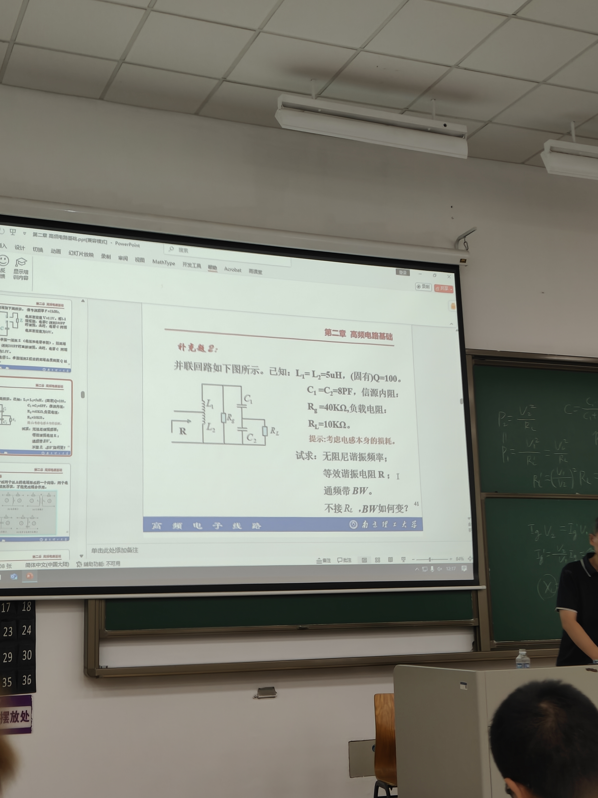

# 2.2 高频电路中的基本电路｜学习日志

> 学习目标：看到谐振回路题，能判断电路类型，选对公式，并完成谐振频率、品质因数、等效电阻、带宽、阻抗折算和谐波抑制度的计算。

## 一、这节到底要掌握什么

本节的主线只有三问：

1. **回路选中哪个频率？**——谐振频率 $f_0$；
2. **选得有多尖？**——品质因数 $Q$ 与通频带 $BW$；
3. **不需要的频率能压下去多少？**——相对幅频特性与谐波抑制度。

并联谐振时，电感和电容支路中的大电流相互抵消，信号源主要补充损耗，因此输入电流小、端电压高、输入阻抗最大。串联谐振则相反：阻抗最小、电流最大。

## 二、A级公式：必须会直接使用

### 1. 谐振频率

$$
\omega_0=\frac{1}{\sqrt{LC}},\qquad
f_0=\frac{1}{2\pi\sqrt{LC}}
$$

已知 $L,C$ 时先算它。实际并联回路含电感损耗 $R_s$ 时：

$$
\omega_p=\sqrt{\frac{1}{LC}-\left(\frac{R_s}{L}\right)^2}
=\omega_0\sqrt{1-\frac{1}{Q^2}}
$$

高频回路通常 $Q\gg1$，所以可用 $\omega_p\approx\omega_0$。

### 2. 特性阻抗与品质因数

$$
\rho=\sqrt{\frac{L}{C}}=\omega_0L=\frac{1}{\omega_0C}
$$

$$
Q=\frac{\rho}{R_s}
=\frac{1}{R_s}\sqrt{\frac{L}{C}}
=\frac{\omega_0L}{R_s}
=\frac{1}{\omega_0CR_s}
$$

选择公式的原则：题目给什么量，就选不需要绕路的形式。

### 3. 串并联等效

高 $Q$ 时，小的串联损耗电阻可等效为大的并联电阻：

$$
\boxed{R_p\approx Q^2R_s}
$$

由 $Q=\rho/R_s$ 还可推得 $R_p\approx Q\rho$，但它是**推导出的快捷式**，复习和考试优先使用教材/PPT明确给出的 $Q=\rho/R_s$ 与 $R_p\approx Q^2R_s$。

### 4. 有载品质因数与通频带

外接信号源和负载后，先把所有电阻折算到同一端口并联，得到 $R_\Sigma$：

$$
Q_L=\frac{R_\Sigma}{\rho},\qquad
BW=\frac{f_0}{Q_L}
$$

结论：负载越重，$R_\Sigma$ 越小，$Q_L$ 越低，带宽越宽，选择性越差。

### 5. 相对幅频特性与谐波抑制度

$$
\alpha_v(\omega)=
\left|\frac{V_o(j\omega)}{V_o(j\omega_0)}\right|
=\frac{1}{\sqrt{1+Q^2\left(\frac{\omega}{\omega_0}-\frac{\omega_0}{\omega}\right)^2}}
$$

第 $n$ 次谐波令 $\omega=n\omega_0$：

$$
\alpha_v(n\omega_0)=
\frac{1}{\sqrt{1+Q^2\left(n-\frac{1}{n}\right)^2}}
$$

若先算的是电压幅度比，则：

$$
\gamma=20\lg\alpha_v(n\omega_0)
$$

例如 $Q=100$ 时，二次谐波约为 $-43.5\,\mathrm{dB}$；数值越负，抑制越强。

## 三、阻抗折算：最容易出错的地方

设低抽头电压与全回路电压之比为

$$
p=\frac{U_{\text{低抽头}}}{U_{\text{全回路}}}<1
$$

- 低抽头负载折算到全回路：$R'=R/p^2$；
- 全回路电阻折算到低抽头端：$R'=p^2R$。

口诀：**低端到高端除以 $p^2$，高端到低端乘以 $p^2$。** 先看电阻跨在哪两个节点；本来就跨全回路的电阻不折算。

## 四、课堂补充题：把知识串起来

已知 $L_1=L_2=5\,\mu\mathrm H$、$C_1=C_2=8\,\mathrm{pF}$、$Q_0=100$、$R_g=40\,\mathrm{k}\Omega$、$R_L=10\,\mathrm{k}\Omega$。

### 第一步：化简主回路

$$
L=L_1+L_2=10\,\mu\mathrm H
$$

$$
C=\frac{C_1C_2}{C_1+C_2}=4\,\mathrm{pF}
$$

因此：

$$
f_0\approx25.16\,\mathrm{MHz},\qquad
\rho=\sqrt{\frac LC}\approx1581\,\Omega
$$

### 第二步：考虑回路自身损耗

先用教材/PPT公式体系：

$$
R_s=\frac{\rho}{Q_0}=15.81\,\Omega
$$

$$
R_{p0}\approx Q_0^2R_s\approx158.1\,\mathrm{k}\Omega
$$

### 第三步：折算外接负载

$R_g$ 跨整个回路，不折算。$R_L$ 跨 $C_2$，且 $C_1=C_2$，故 $p_C=1/2$：

$$
R_L'=\frac{R_L}{p_C^2}=40\,\mathrm{k}\Omega
$$

全回路谐振电阻：

$$
R_{\text{全}}=R_{p0}\parallel R_g\parallel R_L'
\approx17.75\,\mathrm{k}\Omega
$$

题目左端是从 $L_2$ 抽头看入，$p_L=1/2$：

$$
R=p_L^2R_{\text{全}}\approx4.44\,\mathrm{k}\Omega
$$

### 第四步：求有载Q和带宽

$$
Q_L=\frac{R_{\text{全}}}{\rho}\approx11.23
$$

$$
BW=\frac{f_0}{Q_L}\approx2.24\,\mathrm{MHz}
$$

不接 $R_L$ 时：

$$
R_{\text{全}}'=158.1\,\mathrm{k}\Omega\parallel40\,\mathrm{k}\Omega
\approx31.92\,\mathrm{k}\Omega
$$

$$
R'\approx7.98\,\mathrm{k}\Omega,\qquad
Q_L'\approx20.19,\qquad
BW'\approx1.25\,\mathrm{MHz}
$$

所以去掉负载后：$R\uparrow\Rightarrow Q\uparrow\Rightarrow BW\downarrow$。

## 五、概念题速记

| 回路 | 低于谐振 | 谐振时 | 高于谐振 |
|---|---|---|---|
| 串联 | 容性 | 纯阻、阻抗最小、电流最大 | 感性 |
| 并联 | 感性 | 纯阻、阻抗最大、电压最大 | 容性 |

- 串联谐振又称“电压谐振”：$U_L\approx U_C\approx QU_s$。
- 并联谐振又称“电流谐振”：$I_L\approx I_C\approx QI_g$。
- $Q$ 越高，曲线越尖、带宽越窄、选择性越好。

## 六、做题固定流程

1. 识别串联/并联、全接入/部分接入；
2. 化简得到总 $L$、总 $C$，求 $f_0$ 与 $\rho$；
3. 用 $Q=\rho/R_s$ 求损耗参数，再用 $R_p\approx Q^2R_s$；
4. 用 $p^2$ 将所有负载折算到同一端口；
5. 并联得到 $R_\Sigma$，求 $Q_L$ 和 $BW$；
6. 若问失谐或谐波，再代入 $\alpha_v(\omega)$ 并换算 dB。

## 七、易错清单

- 不要把无载 $Q_0$ 直接当作接入负载后的 $Q_L$。
- 不要看到抽头就自动折算，先确认电阻实际跨接的节点。
- 折算方向不同，$p^2$ 是乘还是除也不同。
- $R_p\approx Q^2R_s$ 是高 $Q$ 近似。
- $20\lg$ 对应电压/电流幅度比；$10\lg$ 对应功率比。
- 计算公式里的 $\omega$ 单位是 rad/s，$f$ 单位是 Hz，二者相差 $2\pi$。

---

**本次掌握标准：**不看答案，能独立完成课堂补充题，并能解释“为什么负载接入后带宽会变宽”。
