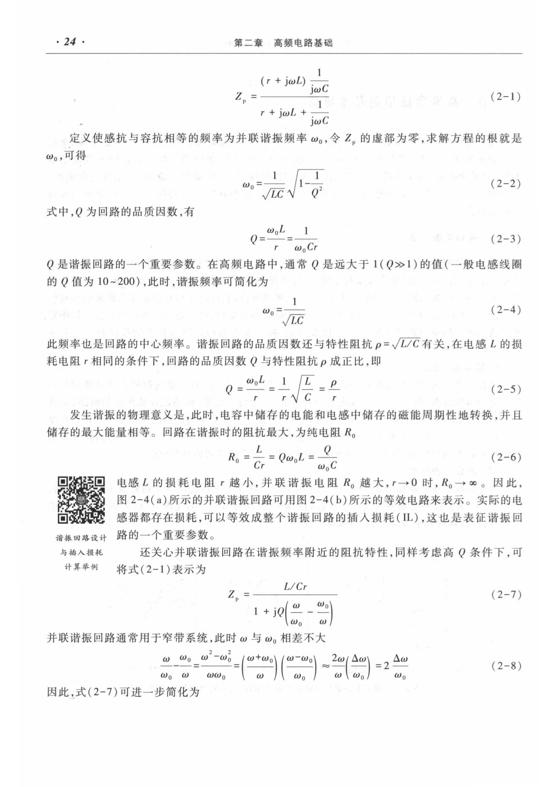
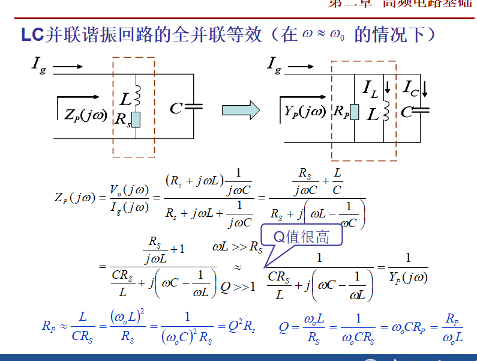
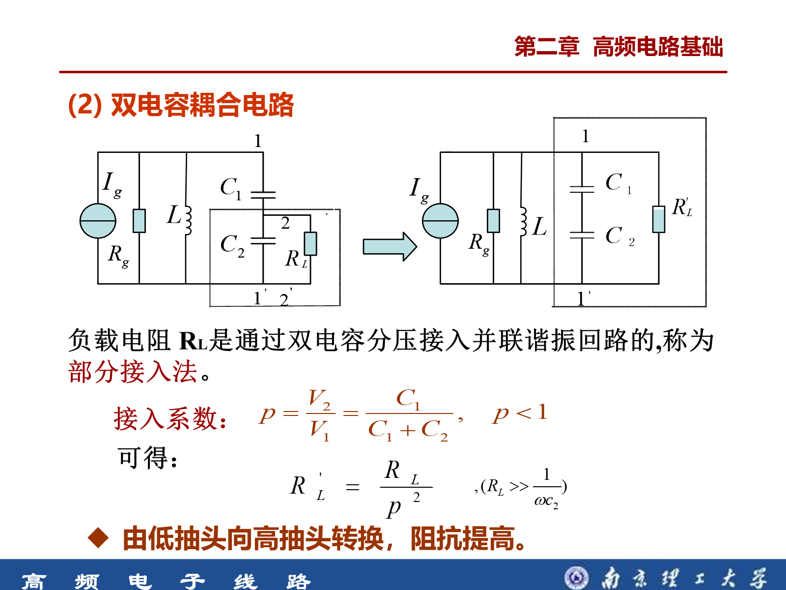
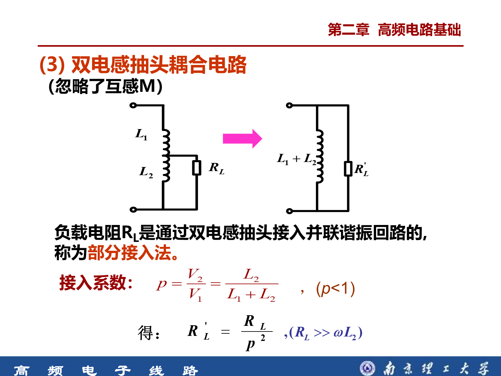
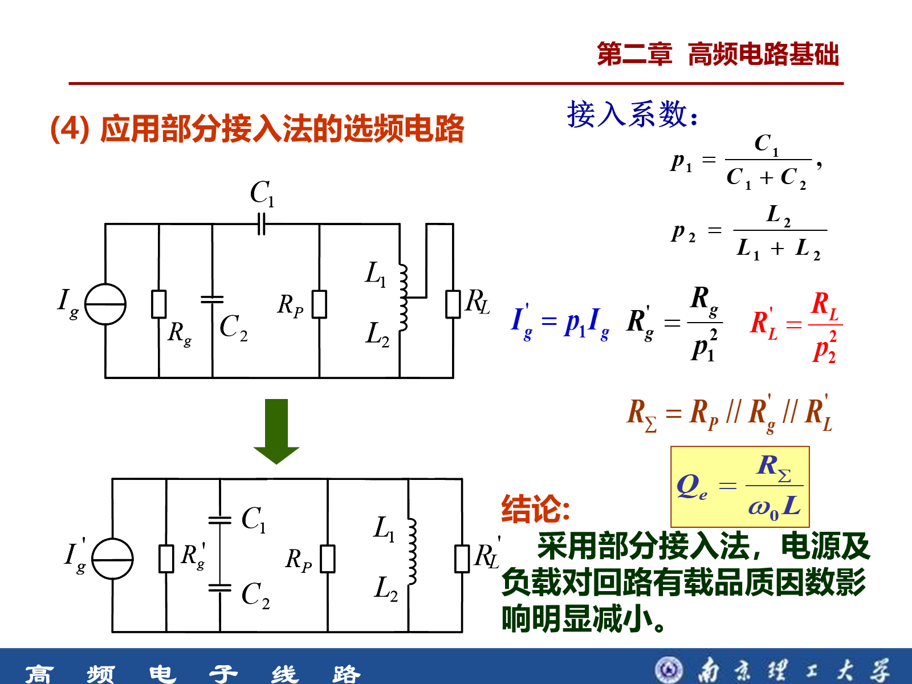
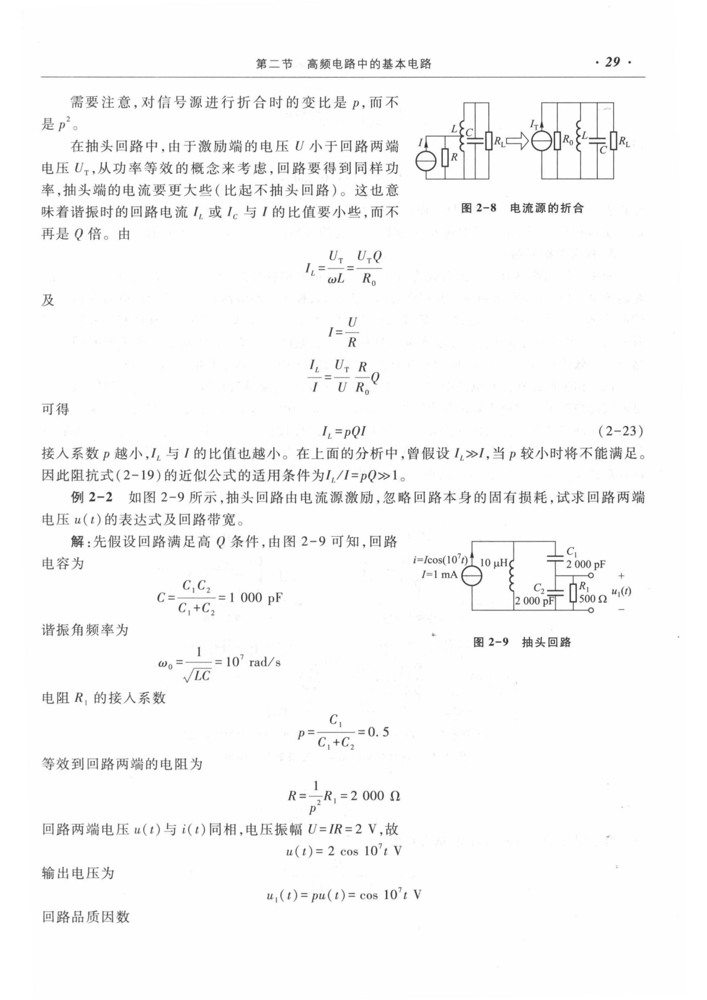
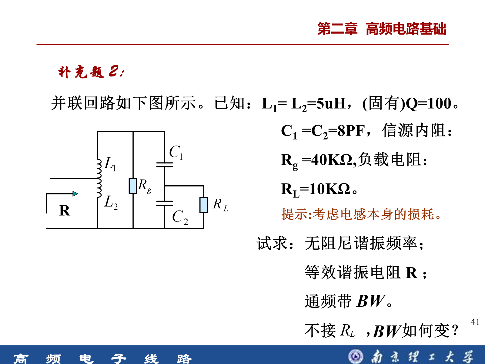

# 2.2 高频电路中的基本电路

> 对应《高频电子线路（第 4 版）》第 2 章第 2 节及课程 PPT。
>
> 学习主线：**谐振回路负责选频；Q 决定选择性；部分接入减轻信源和负载的影响；耦合回路负责传输、阻抗变换和改善频率特性。**

## 1. 这一节是什么

本节介绍高频电路中最基础的选频与耦合网络：串联谐振回路、并联谐振回路、抽头并联回路、阻抗串并联等效和耦合振荡回路。

它们共同回答四个问题：

1. 回路在哪个频率谐振？
2. 回路选频有多“尖”？
3. 信号源和负载为什么会使 Q 下降、带宽变宽？
4. 如何利用抽头或耦合减轻外电路的影响？

一句话概括：**谐振频率决定“选谁”，Q 和带宽决定“选得多准”，接入系数决定“外电路影响多大”。**

---

## 2. 串联谐振回路

实际串联回路可看成 $`L`$、$`C`$ 与串联损耗 $`R_s`$ 串联：

```math
Z_s=R_s+j\left(\omega L-\frac{1}{\omega C}\right)
```

谐振时感抗与容抗相消：

```math
\omega_0=\frac{1}{\sqrt{LC}},
f_0=\frac{1}{2\pi\sqrt{LC}}
```

### 2.1 谐振特点

- 呈纯电阻性，$`Z_s(\omega_0)=R_s`$；
- 阻抗最小，电流最大；
- $`U_L`$ 与 $`U_C`$ 大小相等、相位相反；
- $`U_L=U_C\approx QU_s`$，因此称为**电压谐振**。

| 频率 | 回路性质 |
| --- | --- |
| $`\omega<\omega_0`$ | 容性 |
| $`\omega=\omega_0`$ | 纯阻性 |
| $`\omega>\omega_0`$ | 感性 |

串联回路空载品质因数：

```math
Q_0=\frac{\omega_0L}{R_s}
=\frac{1}{\omega_0CR_s}
=\frac{1}{R_s}\sqrt{\frac{L}{C}}
```

---

## 3. 并联谐振回路

### 3.1 实际模型与谐振频率

教材采用“有损电感支路与电容并联”的模型：

```math
Z_p(j\omega)=
\frac{(R_s+j\omega L)\dfrac{1}{j\omega C}}
{R_s+j\omega L+\dfrac{1}{j\omega C}}
```

含损耗时：

```math
\omega_p=
\sqrt{\frac{1}{LC}-\left(\frac{R_s}{L}\right)^2}
=\omega_0\sqrt{1-\frac{1}{Q_0^2}}
```

高频回路通常满足 $`Q_0\gg1`$，所以 $`\omega_p\approx\omega_0`$。



### 3.2 特性阻抗与 Q

```math
\rho=\sqrt{\frac{L}{C}}
=\omega_0L
=\frac{1}{\omega_0C}
```

```math
Q_0=\frac{\rho}{R_s}
```

这些 Q 公式是同一关系的不同写法。题目给什么量，就选最直接的一式。

#### 为什么计算 Q 时好像只使用电感

不是“不管电容”，而是谐振时电感与电容满足：

```math
\omega_0L=\frac{1}{\omega_0C}=\rho
```

所以电感形式和电容形式可以互相替换。对小的串联损耗 $`R_s`$：

```math
Q_0=\frac{\omega_0L}{R_s}
=\frac{1}{\omega_0CR_s}
=\frac{\rho}{R_s}
```

对大的并联电阻 $`R_p`$：

```math
Q_0=\frac{R_p}{\omega_0L}
=\omega_0CR_p
=\frac{R_p}{\rho}
```

因此，求 Q 时真正应该先判断的是**电阻属于串联损耗模型还是并联等效模型**。使用 L 或使用 C 只是两种等价写法；如果两种算法结果不同，通常说明谐振频率、等效电容或电阻折算中有一项用错了。

### 3.3 谐振特点

- 呈纯电阻性；
- 输入阻抗和端电压最大；
- 电感与电容支路存在反向环流；
- $`I_L=I_C\approx QI_g`$，因此称为**电流谐振**。

| 频率 | 并联回路性质 |
| --- | --- |
| $`\omega<\omega_0`$ | 感性 |
| $`\omega=\omega_0`$ | 纯阻性、阻抗最大 |
| $`\omega>\omega_0`$ | 容性 |

### 3.4 全并联等效

高 Q 时，可把电感的串联损耗等效为并联损耗：

```math
R_p\approx Q_0^2R_s,\quad X_p\approx X_s
```



由 $`Q_0=\rho/R_s`$ 可推得 $`R_p\approx Q_0\rho`$，但复习时优先掌握教材/PPT直接给出的：

```math
Q_0=\frac{\rho}{R_s},\quad R_p\approx Q_0^2R_s
```

> $`R_p\approx Q_0^2R_s`$ 与 $`X_p\approx X_s`$ 都是高 Q 近似，不是任意条件下的精确等式。

#### 教材式（2-6）的 $`R_0`$ 在计算什么

教材把线圈自身很小的串联损耗记为 $`r`$，把它在谐振时等效到整个并联 LC 回路两端，得到大的并联谐振电阻 $`R_0`$：

```math
R_0=\frac{L}{Cr}
=Q_0\omega_0L
=\frac{Q_0}{\omega_0C}
```

在高 Q 近似下，它与前面的串—并联转换完全相同：

```math
R_0\approx Q_0^2r
```

这里不是又定义了一个不同的并联电阻，而是同一结果的不同写法：

- $`r`$：线圈自身的小串联损耗；
- $`R_0`$：只考虑线圈自身损耗时，整个 LC 回路的并联谐振电阻；
- $`R_L'`$：外接负载经过抽头折算后的并联电阻；
- $`R_\Sigma=R_0\parallel R_L'\parallel R_g'`$：考虑所有损耗后的总并联电阻。

最终有载品质因数应由 $`R_\Sigma`$ 计算，而不是在 $`R_0`$、$`R_L'`$ 中任选一个。

---

## 4. 选频能力：Q、带宽和矩形系数

### 4.1 相对幅频特性

```math
\alpha_v(\omega)=
\left|\frac{V_o(j\omega)}{V_o(j\omega_0)}\right|
=\frac{1}{\sqrt{1+Q^2\left(
\dfrac{\omega}{\omega_0}-\dfrac{\omega_0}{\omega}
\right)^2}}
```

谐振点 $`\alpha_v=1`$。Q 越大，离开谐振点后下降越快，曲线越尖。

### 4.2 通频带

半功率点的电压幅度为谐振值的 $`1/\sqrt{2}\approx0.707`$。高 Q 时：

```math
BW_{0.7}=f_2-f_1\approx\frac{f_0}{Q}
```

教材有时用角频率表示带宽，此时写成：

```math
B_\omega=\omega_2-\omega_1\approx\frac{\omega_0}{Q}
```

两式并不矛盾。因为 $`\omega=2\pi f`$：

```math
B_\omega=2\pi B_f
```

| 写法 | 公式 | 单位 |
| --- | --- | --- |
| 普通频率带宽 | $`B_f=f_0/Q`$ | Hz |
| 角频率带宽 | $`B_\omega=\omega_0/Q`$ | rad/s |

看到教材写 $`\omega_0/Q`$ 时，要检查结果单位是否为 rad/s；若题目要求 Hz，还要除以 $`2\pi`$。

```text
Q 增大 → 带宽变窄 → 选择性变好
Q 减小 → 带宽变宽 → 选择性变差
```

### 4.3 矩形系数

```math
K_{0.1}=\frac{BW_{0.1}}{BW_{0.7}}
```

$`K_{0.1}`$ 越接近 1 越理想。PPT指出，单谐振回路的 $`K_{0.1}`$ 接近 10，且基本不随 Q 和谐振频率改变；提高 Q 只能使曲线变窄，不能根本改善矩形系数。

### 4.4 谐波抑制度

第 n 次谐波令 $`\omega=n\omega_0`$：

```math
\alpha_v(n\omega_0)=
\frac{1}{\sqrt{1+Q^2\left(n-\dfrac{1}{n}\right)^2}}
```

电压幅度比换算为 dB：

```math
\gamma_n=20\lg\alpha_v(n\omega_0)
```

$`Q=100`$ 时，二次谐波相对基波约为 $`-43.5`$ dB。也可把抑制量表述为正数 $`43.5`$ dB。

---

## 5. 信号源和负载的影响

把信源内阻、负载和回路损耗都折算到同一端口：

```math
R_\Sigma=R_p\parallel R_g\parallel R_L
```

有载品质因数：

```math
Q_L=\frac{R_\Sigma}{\rho}
=\frac{R_\Sigma}{\omega_0L}
```

```text
接入信源或负载
→ 总并联电阻减小
→ 有载 Q 降低
→ 通频带变宽
→ 选择性变差
```

并联回路希望用内阻较大的恒流源激励；串联回路希望用内阻较小的恒压源激励。

---

## 6. 抽头并联回路与部分接入法

### 6.1 统一规律

设接入系数为低抽头电压与全回路电压之比：

```math
p=\frac{V_{\text{低抽头}}}{V_{\text{高抽头}}},\quad p<1
```

由功率等效：

```math
R_{\text{低端折算到高端}}=\frac{R_{\text{低端}}}{p^2}
```

反向折算：

```math
R_{\text{高端折算到低端}}=p^2R_{\text{高端}}
```

记忆：**低端到高端除以 $`p^2`$；高端到低端乘以 $`p^2`$。**

### 6.2 双电容分压接入

按 PPT 图中的连接和电压定义：

```math
p_C=\frac{V_2}{V_1}=\frac{C_1}{C_1+C_2},
R_L'=\frac{R_L}{p_C^2}
```



> 电容分压比容易把 $`C_1`$、$`C_2`$ 写反。应由串联电容电荷相同、$`V=Q/C`$ 重新判断。

### 6.3 双电感抽头接入

课程 PPT 在该模型中**明确忽略互感 M**，所以：

```math
L=L_1+L_2,
p_L=\frac{V_2}{V_1}=\frac{L_2}{L_1+L_2}
```

```math
R_L'=\frac{R_L}{p_L^2}
```



> 上式是本课程 PPT 在“忽略互感 M”的模型下使用的结果。若题目改用理想变压器、耦合电感或直接给匝数比，必须改用相应模型。

### 6.4 为什么部分接入有效

因为 $`p<1`$，低端负载折算到全回路后变为 $`R_L/p^2`$，等效并联电阻增大，对回路 Q 的影响减小。



先看电阻实际跨在哪两个节点：跨全回路的电阻不折算，只跨局部的电阻才折算。

### 6.5 教材例 2-2：为什么用 $`Q=R/(\omega_0L)`$



例题给出 $`L=10`$ μH、$`C_1=C_2=2000`$ pF、$`R_1=500`$ Ω，电流源为 $`i(t)=1\cos(10^7t)`$ mA，并明确忽略回路自身的固有损耗。

#### 第一步：求整个回路的等效电容和谐振角频率

```math
C=\frac{C_1C_2}{C_1+C_2}=1000\ \text{pF}
```

```math
\omega_0=\frac{1}{\sqrt{LC}}=10^7\ \text{rad/s}
```

#### 第二步：把局部负载折算到整个并联回路

```math
p=\frac{C_1}{C_1+C_2}=0.5
```

```math
R=\frac{R_1}{p^2}=2000\ \Omega
```

折算后的 $`R`$ 是跨在整个 LC 回路两端的**大并联电阻**，所以应使用并联模型的品质因数：

```math
Q=\frac{R}{\omega_0L}
=\omega_0CR
=\frac{R}{\rho}
```

代入电感形式：

```math
Q=\frac{2000}{10^7\times10\times10^{-6}}=20
```

用电容形式复核：

```math
Q=10^7\times1000\times10^{-12}\times2000=20
```

两种算法完全相同。因此教材不是“只管电感、不管电容”，而是选择了并联 Q 的电感写法。

#### 第三步：求回路电压和抽头输出电压

谐振时回路呈纯电阻，电流源幅度为 1 mA：

```math
U=IR=1\ \text{mA}\times2000\ \Omega=2\ \text{V}
```

```math
u(t)=2\cos(10^7t)\ \text{V}
```

抽头输出电压为：

```math
u_1(t)=p u(t)=\cos(10^7t)\ \text{V}
```

#### 第四步：区分两种带宽单位

教材计算的是角频率带宽：

```math
B_\omega=\frac{\omega_0}{Q}
=5\times10^5\ \text{rad/s}
```

若换算为普通频率带宽：

```math
B_f=\frac{B_\omega}{2\pi}
=\frac{f_0}{Q}
\approx79.6\ \text{kHz}
```

#### 如果不能忽略线圈自身损耗

教材例题忽略了线圈自身损耗，所以直接用 $`R=2000`$ Ω。若线圈还有式（2-6）给出的固有并联谐振电阻 $`R_0`$，应先求：

```math
R_\Sigma=R_0\parallel R
```

再计算：

```math
Q_L=\frac{R_\Sigma}{\omega_0L}
```

这正是式（2-6）与例 2-2 的关系：前者描述线圈自身损耗，后者描述外接负载；两者存在时要并联后共同决定有载 Q。

---

## 7. 阻抗的串—并联等效

串联形式为 $`Z_s=R_s+jX_s`$，并联形式为 $`Z_p=R_p\parallel jX_p`$。等效是指在该频率下端口阻抗相同，不是参数逐项相等。

```math
R_p=R_s(1+Q^2),
X_p=X_s\left(1+\frac{1}{Q^2}\right)
```

其中 $`Q=|X_s|/R_s`$。高 Q 时：

```math
R_p\approx Q^2R_s,\quad X_p\approx X_s
```

结论：小的串联电阻变成大的并联电阻；电抗性质不变；等效前后的端口阻抗和 Q 不变。

---

## 8. 耦合振荡回路

两个或多个回路通过公共电抗或公共电阻交换能量，构成耦合回路。接信号源的称为初级回路，接负载的称为次级回路。

主要用途：

- 阻抗变换和高频信号传输；
- 获得比单谐振回路更好的频率特性。

互感耦合系数常写为：

```math
k=\frac{M}{\sqrt{L_1L_2}},\quad 0\le k\le1
```

$`k`$ 越大，耦合越强。强耦合时可能出现双峰频率特性。

---

## 9. 课堂补充题 2：完整模板



已知 $`L_1=L_2=5`$ μH，$`C_1=C_2=8`$ pF，固有 $`Q_0=100`$，$`R_g=40`$ kΩ，$`R_L=10`$ kΩ。按 PPT 模型，双电感抽头忽略互感 M。

### 9.1 化简主回路

```math
L=L_1+L_2=10\ \text{μH}
```

```math
C=\frac{C_1C_2}{C_1+C_2}=4\ \text{pF}
```

```math
f_0\approx25.16\ \text{MHz},
\rho=\sqrt{\frac{L}{C}}\approx1581\ \Omega
```

### 9.2 回路自身损耗

```math
R_s=\frac{\rho}{Q_0}\approx15.81\ \Omega
```

```math
R_{p0}\approx Q_0^2R_s\approx158.1\ \text{k}\Omega
```

### 9.3 折算信号源和负载

$`R_g`$ 跨整个回路，不折算。$`R_L`$ 跨 $`C_2`$，且 $`C_1=C_2`$：

```math
p_C=\frac{C_1}{C_1+C_2}=\frac12,
R_L'=\frac{R_L}{p_C^2}=40\ \text{k}\Omega
```

全回路高抽头两端的谐振电阻：

```math
R_\Sigma=R_{p0}\parallel R_g\parallel R_L'
\approx17.75\ \text{k}\Omega
```

题图中的 R 是从 $`L_2`$ 低抽头端看入：

```math
p_L=\frac{L_2}{L_1+L_2}=\frac12
```

```math
R=p_L^2R_\Sigma\approx4.44\ \text{k}\Omega
```

> $`17.75`$ kΩ 是全回路高端的等效电阻；$`4.44`$ kΩ 才是题图左侧低抽头端口看到的 R。

### 9.4 有载 Q 和带宽

```math
Q_L=\frac{R_\Sigma}{\rho}\approx11.23
```

```math
BW=\frac{f_0}{Q_L}\approx2.24\ \text{MHz}
```

不接 $`R_L`$ 时：

```math
R_\Sigma'=R_{p0}\parallel R_g\approx31.92\ \text{k}\Omega
```

```math
R'\approx7.98\ \text{k}\Omega,\quad
Q_L'\approx20.19,\quad
BW'\approx1.25\ \text{MHz}
```

去掉负载后：端口电阻增大、有载 Q 增大、通频带变窄。

---

## 10. 核心公式速查

| 名称 | 公式 | 条件或用途 |
| --- | --- | --- |
| 谐振频率 | $`f_0=1/(2\pi\sqrt{LC})`$ | 串联、并联高 Q 回路 |
| 特性阻抗 | $`\rho=\sqrt{L/C}=\omega_0L`$ | 连接 L、C、Q 与损耗 |
| 空载 Q | $`Q_0=\rho/R_s`$ | $`R_s`$ 为串联损耗 |
| 并联等效电阻 | $`R_p\approx Q_0^2R_s`$ | 高 Q 近似 |
| 并联模型的 Q | $`Q=R_p/(\omega_0L)=\omega_0CR_p`$ | L、C 写法等价 |
| 有载 Q | $`Q_L=R_\Sigma/\rho`$ | 电阻已折算到同一端口 |
| Hz 带宽 | $`B_f\approx f_0/Q_L`$ | 结果单位为 Hz |
| 角频率带宽 | $`B_\omega\approx\omega_0/Q_L`$ | 结果单位为 rad/s |
| 低端到高端 | $`R'=R/p^2`$ | 部分接入 |
| 双电容接入系数 | $`p_C=C_1/(C_1+C_2)`$ | 按 PPT 图示定义 |
| 双电感接入系数 | $`p_L=L_2/(L_1+L_2)`$ | 忽略互感 M |
| 矩形系数 | $`K_{0.1}=BW_{0.1}/BW_{0.7}`$ | 越接近 1 越理想 |

---

## 11. 常见考点与题型

1. **串联/并联谐振辨析：**判断阻抗、电流、电压及谐振点两侧的电抗性质。
2. **完整参数计算：**$`L,C`$ → $`f_0,\rho`$ → $`Q_0`$ → $`R_p`$ → $`BW`$。
3. **信源和负载影响：**统一端口、并联求 $`R_\Sigma`$、再求 $`Q_L`$ 与带宽。
4. **部分接入：**先确认跨接节点和折算方向，再使用 $`p^2`$。
5. **失谐与谐波：**代入相对幅频特性，并正确换算 dB。
6. **耦合回路：**会写耦合系数，理解阻抗变换、传输和改善频率特性的作用。

---

## 12. 易错点

1. 把有损并联谐振频率严格写成 $`1/\sqrt{LC}`$；这只是高 Q 近似。
2. 把无载 $`Q_0`$ 当作接入信源和负载后的 $`Q_L`$。
3. 把 $`R_p\approx Q^2R_s`$ 当作精确式。
4. 看到抽头就自动折算；跨全回路的电阻不用折算。
5. 把折算方向弄反；低端到高端除以 $`p^2`$，反向乘以 $`p^2`$。
6. 写反双电容接入系数；应根据 $`V=Q/C`$ 判断。
7. 把双电感公式当成通式；本课公式以“忽略互感 M”为前提。
8. 混淆全回路电阻与低抽头端口电阻。
9. 混淆 $`20\lg`$ 和 $`10\lg`$；前者用于幅度比，后者用于功率比。
10. 混淆 f 与 $`\omega`$；$`\omega=2\pi f`$。
11. 看到并联 Q 写成 $`R/(\omega_0L)`$ 就认为没有考虑电容；谐振时它与 $`\omega_0CR`$ 完全等价。
12. 混淆线圈固有并联电阻 $`R_0`$ 与外接负载折算电阻 $`R_L'`$；两者同时存在时应并联。
13. 把 $`\omega_0/Q`$ 直接当成 Hz；它是 rad/s，换成 Hz 还要除以 $`2\pi`$。
14. 认为 Q 越高总是越好；通信信号所需带宽必须完整通过。

---

## 13. 自测问题

1. 串联和并联谐振在谐振时分别有什么特点？
2. 为什么实际并联谐振频率略低于无阻尼谐振频率？
3. $`\rho`$、$`Q_0`$、$`R_s`$ 和 $`R_p`$ 有什么关系？
4. 为什么并联负载会使带宽变宽？
5. 部分接入为什么能减轻负载的影响？
6. 双电感公式 $`L_2/(L_1+L_2)`$ 的适用前提是什么？
7. 例题中 $`17.75`$ kΩ 与 $`4.44`$ kΩ 分别表示什么？
8. Q 提高后，通频带和矩形系数分别怎样变化？
9. 耦合回路的两个主要用途是什么？

<details>
<summary><strong>查看全部答案</strong></summary>

### 1. 谐振特点

串联谐振时阻抗最小、电流最大，称为电压谐振；并联谐振时阻抗最大、端电压最大，称为电流谐振。

### 2. 实际并联谐振频率

电感含串联损耗，$`\omega_p=\omega_0\sqrt{1-1/Q_0^2}`$，根号因子小于 1；高 Q 时差异很小。

### 3. 参数关系

```math
\rho=\sqrt{\frac{L}{C}},\quad
Q_0=\frac{\rho}{R_s},\quad
R_p\approx Q_0^2R_s\approx Q_0\rho
```

最后两个关系采用高 Q 近似。

### 4. 负载为何使带宽变宽

负载使 $`R_\Sigma`$ 减小，$`Q_L=R_\Sigma/\rho`$ 降低，所以 $`BW=f_0/Q_L`$ 增大。

### 5. 部分接入的作用

低端负载折算到全回路为 $`R_L/p^2`$；$`p<1`$，折算电阻变大，加载作用减弱。

### 6. 双电感公式的前提

本课程 PPT 明确采用忽略互感 M 的模型。若使用理想变压器、耦合电感或匝数比模型，应改用相应关系。

### 7. 两个电阻的含义

$`17.75`$ kΩ 是全回路高端的总并联电阻；$`4.44`$ kΩ 是从左侧低抽头端口看到的电阻。

### 8. Q 的影响

Q 增大时带宽变窄；但单谐振回路的矩形系数基本不随 Q 改善，仍接近 10。

### 9. 耦合回路用途

一是阻抗变换与信号传输；二是形成比单谐振回路更好的频率特性。

</details>

---

## 14. 一页记忆框架

```text
高频基本电路
├─ 谐振
│  ├─ 串联：Z 最小、I 最大、电压谐振
│  └─ 并联：Z 最大、V 最大、电流谐振
├─ 选择性：f₀ 决定选谁，Q/BW 决定选得多尖
├─ 外电路加载：RΣ↓ → QL↓ → BW↑
├─ 部分接入：低端负载除以 p² 折算到高端
├─ 串并联等效：高 Q 时 Rp≈Q²Rs，Xp≈Xs
└─ 耦合回路：阻抗变换、传输、改善频率特性
```

记住最后一句：**先统一模型和端口，再统一折算方向，最后计算 Q 与带宽。**
