# 2.2 高频电路中的基本电路｜学习日志

> 依据：《高频电子线路（第 4 版）》第 2 章第 2 节、课程第二章 PPT（第 2～58 页）以及课堂补充题截图。PPT 第 59 页开始进入 2.3，因此本文到陶瓷滤波器为止。
>
> 学习主线：**简单谐振回路 → 有损并联回路 → 串并联等效 → Q、负载与带宽 → 抽头部分接入 → 耦合振荡回路 → 集中滤波器。**

## 0. 先看这张学习地图

高频振荡回路是高频放大器、振荡器和滤波器的基础无源网络，主要完成**选频、阻抗变换和信号传输**。

```text
LC 决定谐振频率 f₀：选哪个频率
        ↓
损耗决定空载 Q₀：回路自身有多“好”
        ↓
信源、负载接入后得到有载 QL：实际曲线有多尖
        ↓
BW = f₀ / QL：实际能通过多宽的频带
        ↓
抽头或耦合：既传输信号，又减轻外电路加载，并改善频率特性
```

### 公式标签

- **【必须会背/会用】**：考试计算的主公式，要能直接判断适用模型。
- **【理解推导即可】**：知道从哪里来，会在需要时推出，不必孤立死背。
- **【易错点】**：课堂提问或练习中已经出现过的混淆点。

---

## 1. 谐振的统一认识：不是两套理论

无论串联还是并联，谐振的本质都是：

```math
\boxed{\text{端口呈纯电阻性，电压与电流同相}}
```

区别只在于哪种表示更方便：

| 回路 | 方便的量 | 相加规则 | 谐振条件 |
| --- | --- | --- | --- |
| 串联 | 阻抗 $`Z=R+jX`$ | $`Z_\Sigma=Z_1+Z_2+\cdots`$ | $`\mathrm{Im}(Z)=X=0`$ |
| 并联 | 导纳 $`Y=G+jB=1/Z`$ | $`Y_\Sigma=Y_1+Y_2+\cdots`$ | $`\mathrm{Im}(Y)=B=0`$ |

所以，“串联常用 $`Z`$、并联常用 $`Y`$”只是为了让同类支路直接相加，并不是换了一套物理规律。

### 1.1 串联谐振条件

串联 RLC 的总阻抗为：

```math
Z_s=R_s+j\omega L+\frac{1}{j\omega C}
=R_s+j\left(\omega L-\frac{1}{\omega C}\right)
```

令虚部为零：

```math
\omega_0L-\frac{1}{\omega_0C}=0
```

得到：

```math
\boxed{\omega_0=\frac{1}{\sqrt{LC}},\qquad
f_0=\frac{1}{2\pi\sqrt{LC}}}
```

**【必须会背/会用】** 串联谐振时：

- $`Z`$ 最小，$`Z(\omega_0)=R_s`$；
- 回路电流最大；
- $`U_L`$ 与 $`U_C`$ 大小相等、相位相反；
- 电抗元件电压可达激励电压的 Q 倍，所以称为**电压谐振**。

| 频率范围 | 串联回路性质 |
| --- | --- |
| $`\omega<\omega_0`$ | 容性 |
| $`\omega=\omega_0`$ | 纯阻性，阻抗最小 |
| $`\omega>\omega_0`$ | 感性 |

### 1.2 并联谐振条件

对理想并联 LC，直接把两支路导纳相加：

```math
Y_p=Y_L+Y_C
=\frac{1}{j\omega L}+j\omega C
=j\left(\omega C-\frac{1}{\omega L}\right)
```

令总电纳为零：

```math
\omega_0C-\frac{1}{\omega_0L}=0
```

仍得到：

```math
\boxed{\omega_0=\frac{1}{\sqrt{LC}}}
```

**【必须会背/会用】** 并联谐振时：

- 端口阻抗最大，端电压最大；
- 两个电抗支路中存在大小很大的反向环流；
- $`I_L=I_C\approx QI_g`$，所以称为**电流谐振**。

| 频率范围 | 并联回路性质 |
| --- | --- |
| $`\omega<\omega_0`$ | 感性 |
| $`\omega=\omega_0`$ | 纯阻性，阻抗最大 |
| $`\omega>\omega_0`$ | 容性 |

**【易错点】** 求并联谐振条件时用 $`Y`$ 最省事；研究“电流源输入后输出电压有多大”时又常用传输阻抗 $`Z_p=V_o/I_g`$。两者不矛盾。

---

## 2. 实际并联谐振回路：先承认线圈有损耗

教材采用“有损电感支路与电容并联”的模型。线圈的各种损耗集中等效为串联电阻 $`R_s`$：

```math
Z_p(j\omega)=
\frac{(R_s+j\omega L)\dfrac{1}{j\omega C}}
{R_s+j\omega L+\dfrac{1}{j\omega C}}
```

实际并联谐振角频率为：

```math
\boxed{\omega_p=
\sqrt{\frac{1}{LC}-\left(\frac{R_s}{L}\right)^2}
=\omega_0\sqrt{1-\frac{1}{Q_0^2}}}
```

当 $`Q_0\gg1`$ 时：

```math
\omega_p\approx\omega_0=\frac{1}{\sqrt{LC}}
```


**【理解推导即可】** 严格谐振频率略低于无阻尼谐振频率；多数课程计算题在高 Q 条件下使用 $`\omega_p\approx\omega_0`$。

**【易错点】** 不要把 $`1/\sqrt{LC}`$ 无条件写成有损并联回路的精确谐振频率。

---

## 3. 两个支路都有电阻：广义并联谐振回路

课堂上看到的广义形式是：一条支路为 $`R_1`$ 与 $`C`$ 串联，另一条支路为 $`R_2`$ 与 $`L`$ 串联，然后两支路并联。

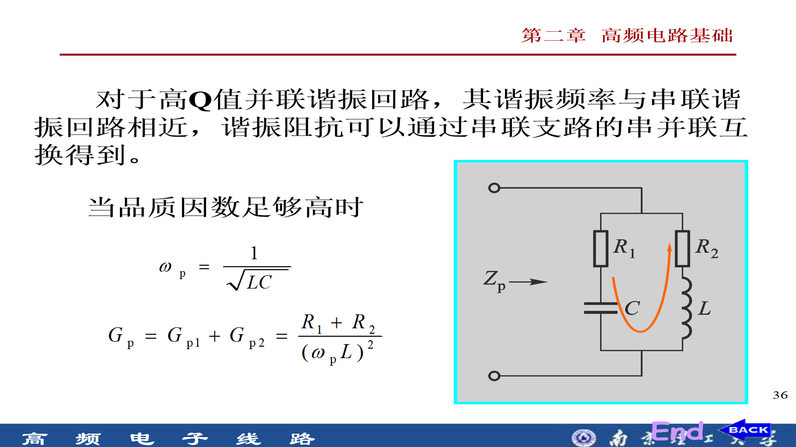

### 3.1 为什么这里出现 $`G_p`$

每条有损串联支路先换成并联形式：

```text
R₁ + C  →  Rp1 ∥ C
R₂ + L  →  Rp2 ∥ L
```

并联支路用导纳最方便，因此损耗用电导相加：

```math
G_p=G_{p1}+G_{p2}
=\frac{1}{R_{p1}}+\frac{1}{R_{p2}}
```

当两个支路都为高 Q 时，串并联等效后电抗近似不变，于是：

```math
\boxed{\omega_p\approx\frac{1}{\sqrt{LC}}}
```

并且在谐振处 $`\omega_pL\approx1/(\omega_pC)`$：

```math
\boxed{G_p\approx\frac{R_1+R_2}{(\omega_pL)^2}}
```

因此谐振电阻可写为：

```math
R_p=\frac{1}{G_p}
\approx\frac{(\omega_pL)^2}{R_1+R_2}
```

**【理解推导即可】** 这一段的真正结论是：复杂有损并联回路只要满足高 Q 条件，就能先把各串联支路变成并联支路，再按简单并联谐振回路处理。

**【易错点】** $`G_{p1}+G_{p2}`$ 是电导相加；若改写成电阻，就是 $`R_p=R_{p1}\parallel R_{p2}`$，不是 $`R_{p1}+R_{p2}`$。

---

## 4. Q 的统一公式体系

### 4.1 特性阻抗 $`\rho`$

**【必须会背/会用】** 在谐振点：

```math
\boxed{\rho=\sqrt{\frac{L}{C}}
=\omega_0L
=\frac{1}{\omega_0C}}
```

$`\rho`$ 把 $`L`$、$`C`$、谐振频率和 Q 公式连接起来。谐振时使用电感形式或电容形式，结果应完全相同。

### 4.2 串联损耗模型

**【必须会背/会用｜教材主公式优先】**

```math
\boxed{Q_0=\frac{\omega_0L}{R_s}
=\frac{1}{\omega_0CR_s}
=\frac{\rho}{R_s}}
```

反求线圈自身串联损耗时，优先写：

```math
\boxed{R_s=\frac{\omega_0L}{Q_0}}
```

本日志按课堂提问时的偏好，优先采用这条教材写法。

### 4.3 并联损耗模型

当损耗已经等效成跨在整个回路两端的并联电阻 $`R_p`$：

```math
\boxed{Q=\frac{R_p}{\omega_0L}
=\omega_0CR_p
=\frac{R_p}{\rho}}
```

记忆：

```math
\boxed{\text{串联：电抗÷电阻；并联：电阻÷电抗}}
```

### 4.4 串并联等效

串联形式 $`Z_s=R_s+jX_s`$ 与并联形式 $`R_p\parallel jX_p`$ 在指定频率下端口等效，并保持 Q 不变。

精确关系为：

```math
R_p=R_s(1+Q^2),\qquad
X_p=X_s\left(1+\frac{1}{Q^2}\right)
```

当 $`Q\gg1`$：

```math
\boxed{R_p\approx Q^2R_s,\qquad X_p\approx X_s}
```


**【必须会背/会用】** 推荐的做题链：

```text
Q₀ = ω₀L / Rs
        ↓ 反求
Rs = ω₀L / Q₀
        ↓ 高 Q 串并联等效
Rp ≈ Q₀²Rs
```

由上式可推得：

```math
R_p\approx Q\rho
```

**【理解推导即可】** $`R_p\approx Q\rho`$ 只是快捷推导式，不作为教材主公式优先背诵。

**【易错点】** $`R_p\approx Q^2R_s`$ 与 $`X_p\approx X_s`$ 都依赖高 Q 条件，不是任何情况下的精确等式。

---

## 5. Q、选择性、负载与带宽

### 5.1 相对幅频特性

```math
\alpha_v(\omega)=
\left|\frac{V_o(j\omega)}{V_o(j\omega_0)}\right|
=\frac{1}{\sqrt{1+Q^2\left(
\dfrac{\omega}{\omega_0}-\dfrac{\omega_0}{\omega}
\right)^2}}
```

Q 越大，谐振曲线越尖，选择性越好。

### 5.2 半功率点带宽

幅度下降到谐振值的 $`1/\sqrt2\approx0.707`$ 时，功率下降为一半。高 Q 时：

```math
\boxed{B_f=f_2-f_1\approx\frac{f_0}{Q}}
```

用角频率表示：

```math
\boxed{B_\omega=\omega_2-\omega_1\approx\frac{\omega_0}{Q}}
```

| 写法 | 单位 |
| --- | --- |
| $`B_f=f_0/Q`$ | Hz |
| $`B_\omega=\omega_0/Q`$ | rad/s |

**【易错点】** $`\omega_0/Q`$ 不能直接写成 Hz；换成 Hz 还要除以 $`2\pi`$。

### 5.3 信号源和负载为什么使 Q 下降

先把线圈损耗、信源内阻和负载全部折算到同一端口：

```math
R_\Sigma=R_{p0}\parallel R_g'\parallel R_L'
```

**【必须会背/会用】** 有载品质因数：

```math
\boxed{Q_L=\frac{R_\Sigma}{\rho}
=\frac{R_\Sigma}{\omega_0L}}
```

```text
并联信源或负载接入
→ 总并联电阻 RΣ 减小
→ 有载 QL 降低
→ 带宽增大
→ 选择性变差
```

因此，并联谐振回路希望用内阻较大的恒流源激励；串联谐振回路希望用内阻较小的恒压源激励。

**【易错点】**

- $`Q_0`$ 是回路自身的空载/固有 Q；$`Q_L`$ 是接入信源、负载后的有载 Q。
- $`R_{p0}`$ 是线圈自身损耗折算出的并联电阻；$`R_L'`$ 是外部负载折算值；两者同时存在时必须并联。
- 纯电阻加载主要改变 Q 与带宽；若外接阻抗还含电抗成分，还可能使谐振频率变化。

### 5.4 矩形系数与谐波抑制度

```math
K_{0.1}=\frac{BW_{0.1}}{BW_{0.7}}
```

$`K_{0.1}`$ 越接近 1 越理想。PPT 给出的结论是：单谐振回路的 $`K_{0.1}`$ 接近 10，且基本不随 Q 和谐振频率改变。因此，提高 Q 会使曲线变窄，但不能根本改善矩形性。

第 n 次谐波的归一化幅度：

```math
\alpha_v(n\omega_0)=
\frac{1}{\sqrt{1+Q^2\left(n-\dfrac{1}{n}\right)^2}}
```

幅度比换算为 dB：

```math
\gamma_n=20\lg\alpha_v(n\omega_0)
```

**【易错点】** 幅度比用 $`20\lg`$；功率比用 $`10\lg`$。

---

## 6. 抽头并联回路与部分接入

### 6.1 接入系数与阻抗折算

设接入系数为低抽头电压与全回路电压之比：

```math
p=\frac{V_{\text{低抽头}}}{V_{\text{全回路}}},\qquad p<1
```

由功率等效得到：

```math
\boxed{R_{\text{低端}\rightarrow\text{高端}}=
\frac{R_{\text{低端}}}{p^2}}
```

反方向：

```math
\boxed{R_{\text{高端}\rightarrow\text{低端}}=
p^2R_{\text{高端}}}
```

**【必须会背/会用】** 低端折到高端除以 $`p^2`$；高端折到低端乘以 $`p^2`$。

### 6.2 双电容抽头

按 PPT 图中的电压定义：

```math
\boxed{p_C=\frac{V_2}{V_1}
=\frac{C_1}{C_1+C_2},\qquad
R_L'=\frac{R_L}{p_C^2}}
```


**【易错点】** 串联电容电荷相同而 $`V=Q/C`$，所以抽头跨 $`C_2`$ 时分子是另一个电容 $`C_1`$。

### 6.3 双电感抽头

课程 PPT 明确采用“忽略互感 $`M`$”的模型：

```math
L=L_1+L_2,qquad
\boxed{p_L=\frac{V_2}{V_1}
=\frac{L_2}{L_1+L_2}}
```

```math
R_L'=\frac{R_L}{p_L^2}
```


**【易错点】** 上式不是所有耦合电感或理想变压器的通式；题目若改用匝数比或不忽略互感，必须按相应模型处理。

### 6.4 为什么部分接入有效

因为 $`p<1`$，负载折到全回路后变成更大的 $`R_L/p^2`$，它与回路并联时造成的加载更轻，因而更能保持 Q。


**做题顺序：** 先看电阻实际跨在哪两个节点，再判断是否折算；跨全回路的电阻不折算，只跨局部的电阻才折算。

### 6.5 教材例 2-2：为什么这里用并联 Q 公式


例题给出 $`L=10\ \mu\text{H}`$、$`C_1=C_2=2000\ \text{pF}`$、$`R_1=500\ \Omega`$，并忽略回路自身固有损耗。

```math
C=\frac{C_1C_2}{C_1+C_2}=1000\ \text{pF},\qquad
\omega_0=\frac{1}{\sqrt{LC}}=10^7\ \text{rad/s}
```

负载跨在电容抽头，$`p=1/2`$，折算到全回路：

```math
R=\frac{R_1}{p^2}=2000\ \Omega
```

这个 $`R`$ 是跨在整个 LC 回路两端的**并联电阻**，所以使用：

```math
\boxed{Q=\frac{R}{\omega_0L}
=\omega_0CR
=\frac{R}{\rho}=20}
```

**【易错点】** 教材选用 $`R/(\omega_0L)`$ 并不是“只考虑电感”；谐振时 $`\omega_0L=1/(\omega_0C)=\rho`$，电感写法与电容写法完全等价。

---

## 7. 耦合振荡回路

耦合回路由两个或两个以上的回路构成，回路之间通过公共电抗或公共电阻完成能量交换。接信号源的回路称为**初级回路**，接负载的回路称为**次级回路**。

### 7.1 功能与通常使用条件

PPT 给出两项主要功能：

1. 进行阻抗转换，完成高频信号传输；
2. 形成比简单振荡回路更好的频率特性。

通常使用时满足：

1. 初、次级回路都对信号频率调谐；
2. 两个回路都为高 Q 回路。

### 7.2 常用两种形式与耦合系数 $`k`$

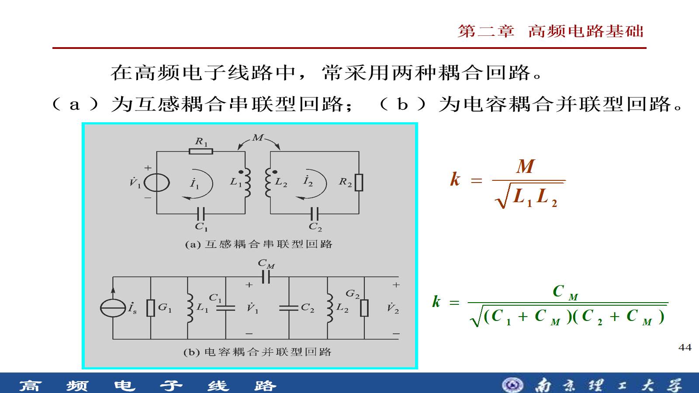

一般定义：

```math
\boxed{k=\frac{|X_{12}|}{\sqrt{X_{11}X_{22}}}}
```

互感耦合串联型：

```math
\boxed{k=\frac{M}{\sqrt{L_1L_2}}}
```

电容耦合并联型：

```math
\boxed{k=\frac{C_M}
{\sqrt{(C_1+C_M)(C_2+C_M)}}}
```

**【必须会背/会用】** $`k`$ 描述结构上的耦合程度；不同耦合结构的公共电抗不同，因此具体公式不同。

### 7.3 反射阻抗

对互感耦合回路，次级回路对初级的影响可以等效为串入初级的反射阻抗：

```math
\boxed{Z_{f1}=\frac{(\omega M)^2}{Z_{22}}}
```

于是初级电流为：

```math
I_1=\frac{V_1}{Z_{11}+Z_{f1}}
```

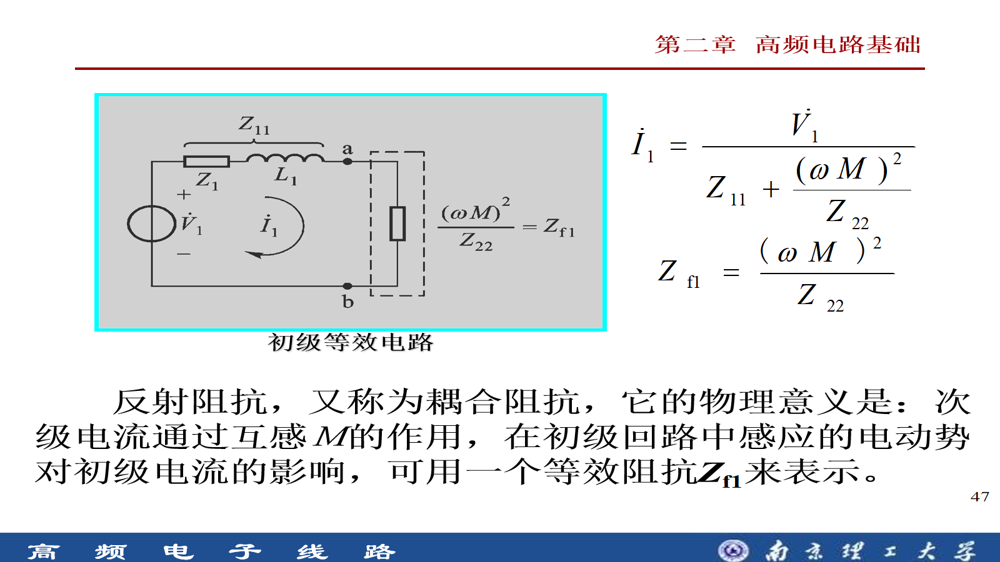

**【理解推导即可】** 反射阻抗不是一个额外的实体元件，而是把“次级电流经互感反过来影响初级”的作用折算到初级端口。它与抽头阻抗折算共享同一个思想：**把另一侧的影响换算到当前分析端口。**

### 7.4 $`k`$ 与耦合因子 $`\eta`$ 不同

在 PPT 给出的“两个回路参数相同、都调谐、Q 相同”的条件下：

```math
\boxed{\eta=Qk}
```

其中 $`k`$ 表示结构耦合程度，$`\eta`$ 把耦合强度与回路 Q 综合起来，用于判断频率响应形状：

| 耦合因子 | 状态 | 响应特点 |
| --- | --- | --- |
| $`\eta<1`$ | 欠耦合 | 单峰，耦合偏弱 |
| $`\eta=1`$ | 临界耦合 | 临界状态 |
| $`\eta>1`$ | 过耦合 | 出现双峰趋势，带宽增大 |

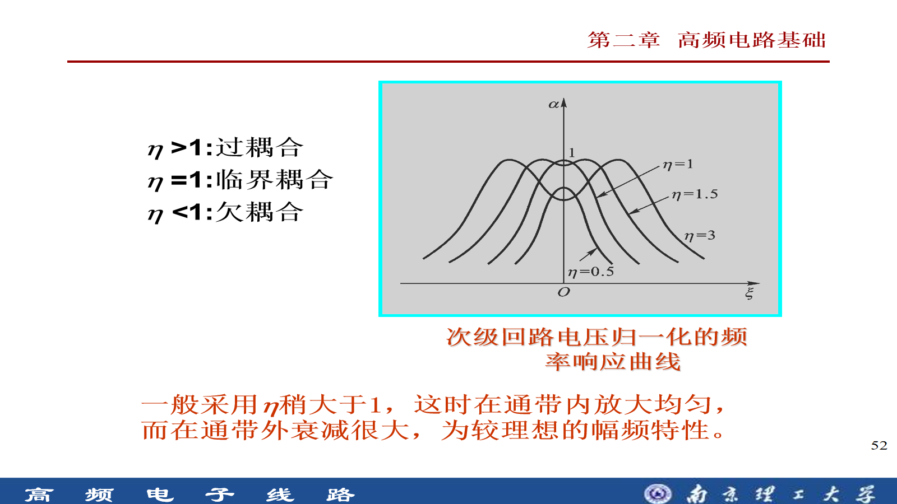

PPT 指出，实际一般采用 $`\eta`$ 稍大于 1，使通带内较均匀、通带外衰减较大，获得较理想的幅频特性。

**【易错点】** $`\eta=Qk`$ 有 PPT 设定的对称双调谐、高 Q 条件；不要脱离条件把它当作所有耦合网络的无条件定义。

---

## 8. 集中滤波器

### 8.1 声表面波滤波器（SAW）

SAW 滤波器以铌酸锂、锆钛酸铅或石英等压电材料为基体，表面制作铝膜或金膜叉指换能器。其过程为：

```text
电信号 → 压电材料弹性形变 → 表面声波传播 → 另一端恢复为电信号
```

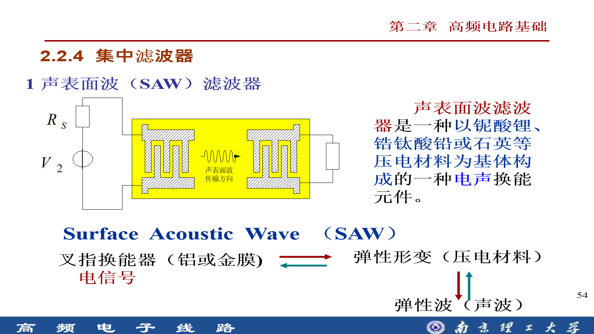

PPT 列出的特点：

- 体积小、重量轻；
- 中心频率可达几 MHz～几 GHz，适合高频、超高频；
- 幅频特性接近理想矩形；
- 相对通频带有时可达 50%；
- 频率特性可由压电基体材料以及叉指换能器的指条数目、疏密和长度设计；
- 接入实际电路时必须实现良好匹配；
- 可采用与集成电路相同的平面工艺，制造简单、重复性好。

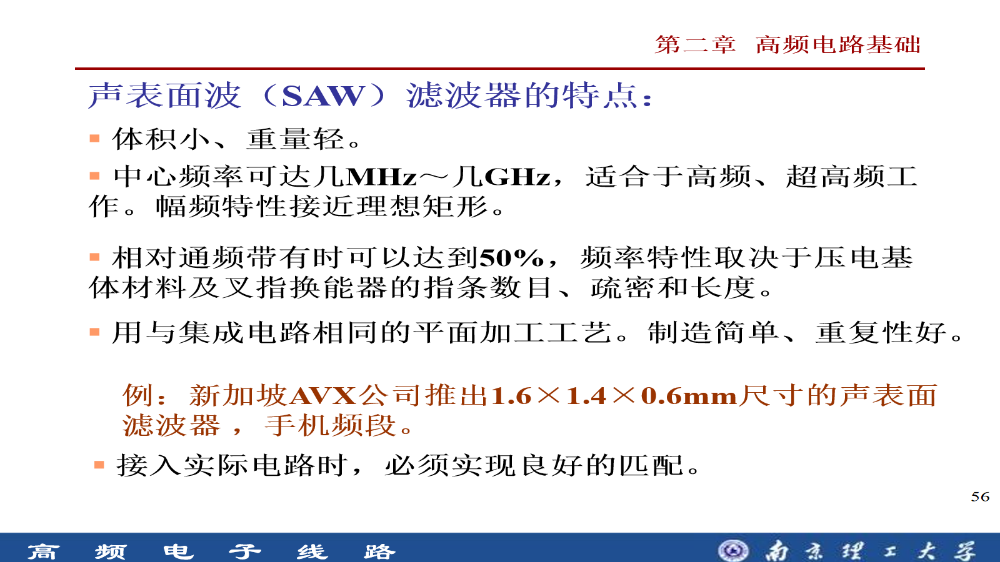

### 8.2 陶瓷滤波器

陶瓷滤波器利用陶瓷片的**压电效应与反压电效应**。PPT 先介绍两端陶瓷滤波器，其等效电路具有两个谐振频率：

```math
f_s=\frac{1}{2\pi\sqrt{L_1C_1}}
```

```math
f_p=\frac{1}{2\pi
\sqrt{L_1\dfrac{C_1C_0}{C_1+C_0}}}
```

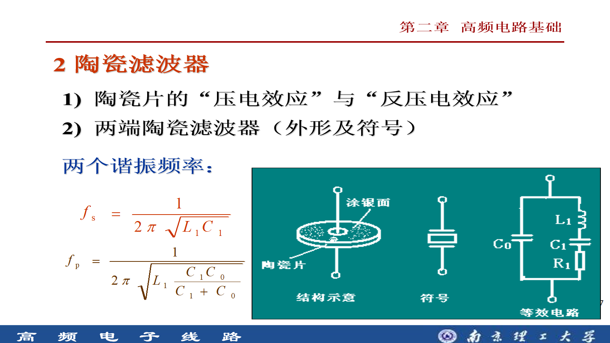

PPT 随后给出三端陶瓷滤波器的结构、符号、等效电路和实物图：

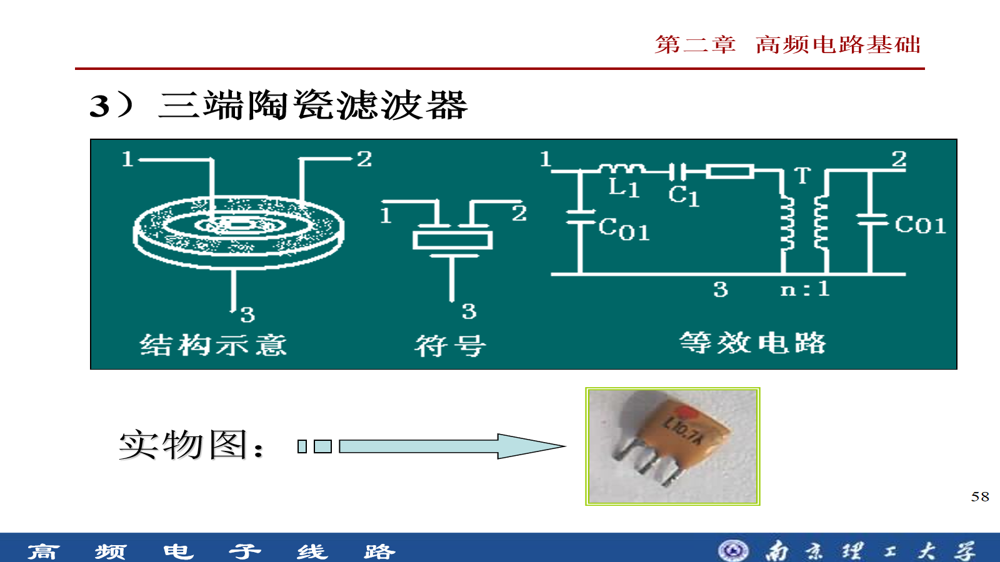

**【理解推导即可】** 这一小节现阶段重点是认识压电/反压电工作基础、两端与三端结构，以及两端器件存在串联谐振和并联谐振；不要超出 PPT 范围自行加入器件参数结论。

---

## 9. 典型题与错题整理

### 9.1 补充题 1：串联谐振测 Q，并接入未知 RC 串联阻抗

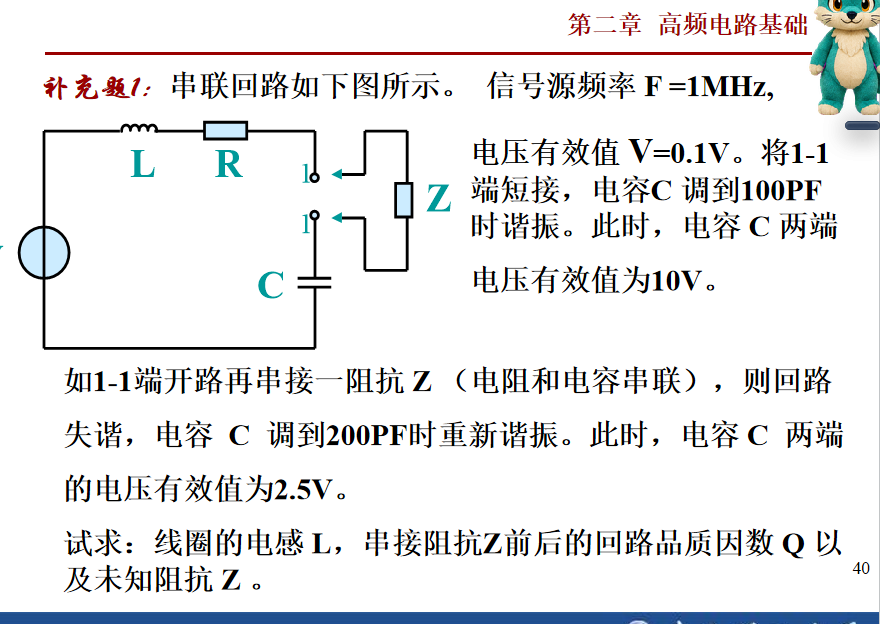

已知 $`f=1\ \text{MHz}`$、电源有效值 $`U=0.1\ \text{V}`$。短接 1—1 端后，把电容调到 $`C_1=100\ \text{pF}`$ 时谐振，电容电压为 $`10\ \text{V}`$。接入由电阻和电容串联组成的未知阻抗 $`Z`$ 后，把原电容调到 $`C_2=200\ \text{pF}`$ 再次谐振，此时该电容电压为 $`2.5\ \text{V}`$。

#### 第一次谐振

```math
L=\frac{1}{(2\pi f)^2C_1}
\approx253.3\ \mu\text{H}
```

普通串联 RLC 中，题目测得的是承担全部容抗的电容电压：

```math
Q_1=\frac{U_C}{U}=\frac{10}{0.1}=100
```

```math
R=\frac{\omega L}{Q_1}
\approx15.92\ \Omega
```

#### 第二次谐振：先求未知电容

未知阻抗写成 $`Z=R_Z+1/(j\omega C_Z)`$。两只电容串联后共同与电感谐振：

```math
\frac{1}{C_1}=\frac{1}{C_2}+\frac{1}{C_Z}
```

代入 $`C_1=100\ \text{pF}`$、$`C_2=200\ \text{pF}`$：

```math
C_Z=200\ \text{pF}
```

此时两个串联电容容抗相同，而题目只测到其中原电容 $`C_2`$ 的电压。先由它求总串联电阻：

```math
\frac{U_{C_2}}{U}=\frac{X_{C_2}}{R_{\Sigma2}}=25
```

```math
R_{\Sigma2}=\frac{X_{C_2}}{25}
\approx31.83\ \Omega
```

电感对应两个电容容抗之和，因此：

```math
Q_2=\frac{X_L}{R_{\Sigma2}}
=2\frac{X_{C_2}}{R_{\Sigma2}}=50
```

```math
R_Z=R_{\Sigma2}-R\approx15.92\ \Omega
```

最终：

```math
\boxed{Z\approx15.92-j795.77\ \Omega}
```

等价于 $`15.92\ \Omega`$ 电阻与 $`200\ \text{pF}`$ 电容串联。

**【本题易错点】** 第二次的 $`2.5/0.1=25`$ 只对应其中一只电容的电压放大倍数，不是整个回路 Q；整个电感与两只串联电容的总容抗平衡，所以 $`Q_2=50`$。

### 9.2 教材 2-4：由中心频率和带宽反求加载电阻

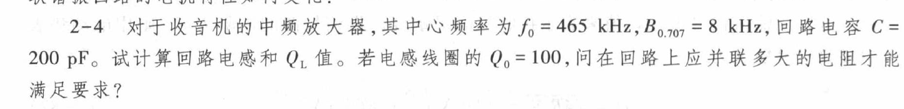

已知 $`f_0=465\ \text{kHz}`$、$`B_{0.707}=8\ \text{kHz}`$、$`C=200\ \text{pF}`$、线圈 $`Q_0=100`$。

```math
L=\frac{1}{(2\pi f_0)^2C}
\approx586\ \mu\text{H}
```

```math
Q_L=\frac{f_0}{B_{0.707}}
=\frac{465}{8}\approx58.1
```

```math
\rho=\omega_0L=\sqrt{\frac{L}{C}}
\approx1711\ \Omega
```

按教材主公式链计算线圈自身损耗：

```math
R_s=\frac{\omega_0L}{Q_0}
\approx17.11\ \Omega
```

```math
R_{p0}\approx Q_0^2R_s
\approx171.1\ \text{k}\Omega
```

目标有载 Q 所要求的总并联电阻：

```math
R_\Sigma=Q_L\rho\approx99.47\ \text{k}\Omega
```

外接电阻 $`R`$ 满足：

```math
R_{p0}\parallel R=R_\Sigma
```

解得：

```math
\boxed{R\approx238\ \text{k}\Omega}
```

**【本题易错点】** $`R_\Sigma\approx99.47\ \text{k}\Omega`$ 是加载后的总并联电阻，不是题目要求外接的电阻；还要从 $`R_{p0}\parallel R=R_\Sigma`$ 反求 $`R`$。

### 9.3 教材 2-6：电容抽头、负载折算与有载 Q

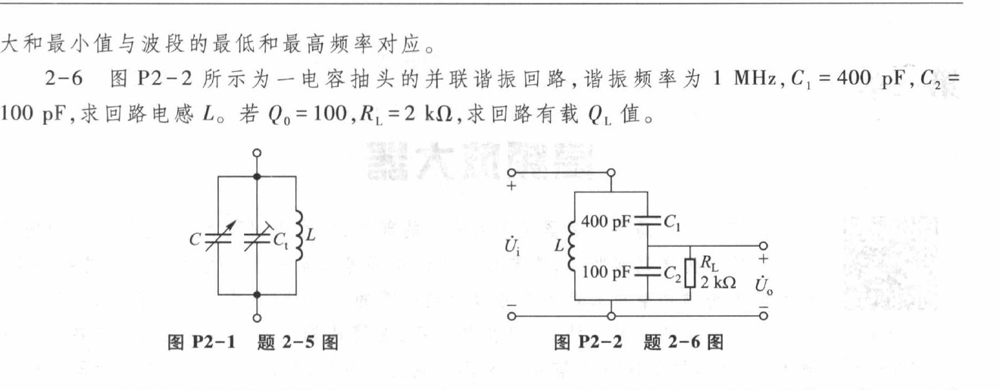

已知 $`f_0=1\ \text{MHz}`$、$`C_1=400\ \text{pF}`$、$`C_2=100\ \text{pF}`$、$`Q_0=100`$、$`R_L=2\ \text{k}\Omega`$。

串联电容的等效值：

```math
C=\frac{C_1C_2}{C_1+C_2}=80\ \text{pF}
```

```math
L=\frac{1}{(2\pi f_0)^2C}
\approx316.6\ \mu\text{H}
```

```math
\rho=\omega_0L=\sqrt{\frac{L}{C}}
\approx1989\ \Omega
```

仍按教材主公式链：

```math
R_s=\frac{\omega_0L}{Q_0}
\approx19.89\ \Omega
```

```math
R_{p0}\approx Q_0^2R_s
\approx198.9\ \text{k}\Omega
```

负载跨在 $`C_2`$ 两端：

```math
p=\frac{C_1}{C_1+C_2}=0.8
```

```math
R_L'=\frac{R_L}{p^2}
=3.125\ \text{k}\Omega
```

```math
R_\Sigma=R_{p0}\parallel R_L'
\approx3.077\ \text{k}\Omega
```

```math
\boxed{Q_L=\frac{R_\Sigma}{\rho}\approx1.55}
```

**【本题易错点】** $`C_2`$ 较小，因此它分到的电压反而较大；跨 $`C_2`$ 的接入系数是 $`C_1/(C_1+C_2)=0.8`$，不是 0.2。

### 9.4 补充题 2：双电感、双电容抽头与带宽


已知 $`L_1=L_2=5\ \mu\text{H}`$、$`C_1=C_2=8\ \text{pF}`$、固有 $`Q_0=100`$、$`R_g=40\ \text{k}\Omega`$、$`R_L=10\ \text{k}\Omega`$。按 PPT，双电感抽头忽略互感 $`M`$。

#### 主回路参数

```math
L=L_1+L_2=10\ \mu\text{H}
```

```math
C=\frac{C_1C_2}{C_1+C_2}=4\ \text{pF}
```

```math
f_0\approx25.16\ \text{MHz},\qquad
\rho\approx1581\ \Omega
```

#### 回路自身损耗

```math
R_s=\frac{\omega_0L}{Q_0}
=\frac{\rho}{Q_0}
\approx15.81\ \Omega
```

```math
R_{p0}\approx Q_0^2R_s
\approx158.1\ \text{k}\Omega
```

#### 统一到全回路高端

$`R_g`$ 已跨整个回路，不折算。$`R_L`$ 跨 $`C_2`$，且 $`p_C=1/2`$：

```math
R_L'=\frac{R_L}{p_C^2}=40\ \text{k}\Omega
```

```math
R_\Sigma=R_{p0}\parallel R_g\parallel R_L'
\approx17.75\ \text{k}\Omega
```

题图所求 $`R`$ 是从 $`L_2`$ 低抽头端看入。$`p_L=1/2`$，所以：

```math
\boxed{R=p_L^2R_\Sigma\approx4.44\ \text{k}\Omega}
```

```math
Q_L=\frac{R_\Sigma}{\rho}\approx11.23
```

```math
\boxed{BW=\frac{f_0}{Q_L}\approx2.24\ \text{MHz}}
```

不接 $`R_L`$ 时：

```math
R_\Sigma'=R_{p0}\parallel R_g
\approx31.92\ \text{k}\Omega
```

```math
R'=p_L^2R_\Sigma'\approx7.98\ \text{k}\Omega
```

```math
Q_L'\approx20.19,\qquad
\boxed{BW'\approx1.25\ \text{MHz}}
```

**【本题易错点】** $`17.75\ \text{k}\Omega`$ 是全回路高端的总并联电阻；$`4.44\ \text{k}\Omega`$ 才是题目左侧低抽头端口看到的等效电阻。观察端口改变不等于回路 Q 改变，Q 仍可在全回路端用 $`R_\Sigma/\rho`$ 计算。

---

## 10. 核心公式速查表

| 优先级 | 公式 | 使用条件 |
| --- | --- | --- |
| 必须会背/会用 | $`\omega_0=1/\sqrt{LC}`$，$`f_0=1/(2\pi\sqrt{LC})`$ | 理想或高 Q 近似谐振频率 |
| 必须会背/会用 | $`\rho=\sqrt{L/C}=\omega_0L=1/(\omega_0C)`$ | 谐振点 |
| 必须会背/会用 | $`Q_0=\omega_0L/R_s=\rho/R_s`$ | 串联损耗模型 |
| 必须会背/会用 | $`Q=R_p/\rho`$ | 并联损耗模型 |
| 必须会背/会用 | $`R_p\approx Q^2R_s`$ | 高 Q 串并联等效 |
| 必须会背/会用 | $`Q_L=R_\Sigma/\rho`$ | 所有电阻已折算到同一并联端口 |
| 必须会背/会用 | $`B_f=f_0/Q_L`$ | 结果单位 Hz |
| 必须会背/会用 | $`B_\omega=\omega_0/Q_L`$ | 结果单位 rad/s |
| 必须会背/会用 | $`R_{低\to高}=R/p^2`$，$`R_{高\to低}=p^2R`$ | 部分接入 |
| 必须会背/会用 | $`p_C=C_1/(C_1+C_2)`$ | 负载跨 PPT 图中的 $`C_2`$ |
| 必须会背/会用 | $`p_L=L_2/(L_1+L_2)`$ | PPT 模型，忽略互感 $`M`$ |
| 必须会背/会用 | $`k=M/\sqrt{L_1L_2}`$ | 互感耦合串联型 |
| 理解条件后会用 | $`\eta=Qk`$ | PPT 的对称、同调谐、同 Q 回路 |
| 理解推导即可 | $`R_p\approx Q\rho`$ | 由教材主公式推得的快捷式 |
| 理解推导即可 | $`Z_{f1}=(\omega M)^2/Z_{22}`$ | 次级反射到初级 |

---

## 11. 最容易出错的判断

1. 先判断电阻属于**串联损耗**还是**并联等效**，再选 Q 公式。
2. 用 Q 公式反求的常是“总损耗电阻”，不一定是某一个单独电阻。
3. 串联谐振测得某个电容电压时，只有该电容承担全部容抗，才能直接写 $`Q=U_C/U`$。
4. $`Q_0`$ 与 $`Q_L`$ 不能混用；看到负载和信源就先统一端口。
5. 跨全回路的电阻不折算；只跨局部的才使用 $`p^2`$。
6. 电容分压不能照搬电阻分压；串联电容越小，分得电压越大。
7. 低端到高端除以 $`p^2`$，高端到低端乘以 $`p^2`$。
8. 高 Q 近似要标条件，尤其是 $`\omega_p\approx1/\sqrt{LC}`$、$`R_p\approx Q^2R_s`$。
9. $`k`$ 是耦合系数，$`\eta`$ 是耦合因子；二者含义不同。
10. 不要把单谐振回路“Q 增大、曲线变窄”误解成“矩形系数明显改善”。

---

## 12. 自测清单

- [ ] 能从 $`\mathrm{Im}(Z)=0`$ 推出串联谐振条件。
- [ ] 能从 $`\mathrm{Im}(Y)=0`$ 推出并联谐振条件。
- [ ] 能解释为什么并联回路常用导纳，而输出特性又常讨论阻抗。
- [ ] 能按 $`Q_0\to R_s\to R_p`$ 的教材主公式链计算。
- [ ] 能把负载、信源和线圈损耗统一折算到同一端口。
- [ ] 能区分 $`Q_0`$、$`Q_L`$、Hz 带宽和 rad/s 带宽。
- [ ] 能根据抽头跨接节点写出正确的 $`p`$，并判断乘还是除 $`p^2`$。
- [ ] 能说明两种耦合回路、耦合系数、反射阻抗和三种耦合状态。
- [ ] 能概述 SAW 的结构与特点，以及陶瓷滤波器的基本工作依据。
- [ ] 能独立重做补充题 1、教材 2-4、教材 2-6 和补充题 2。

最后记住一条总原则：**先判模型，再统一端口；先用教材主公式，再用高 Q 近似；最后由 Q 判断带宽和选择性。**
