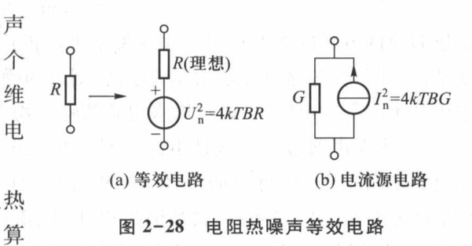
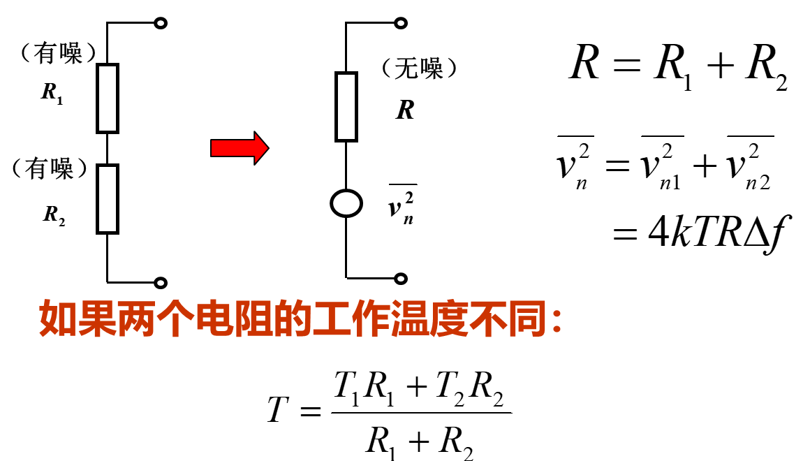
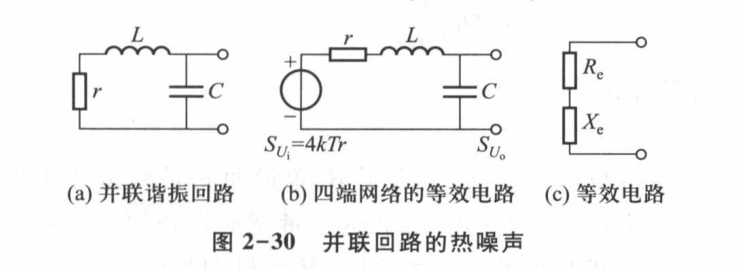
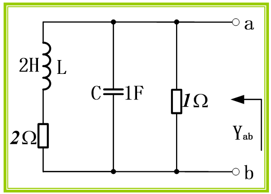
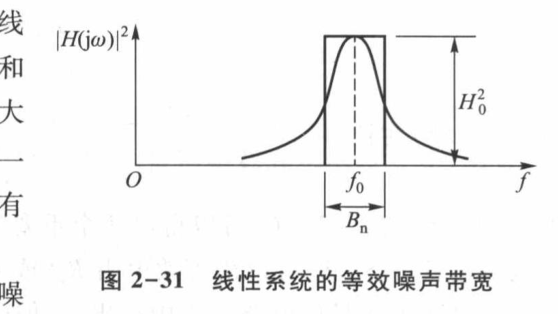
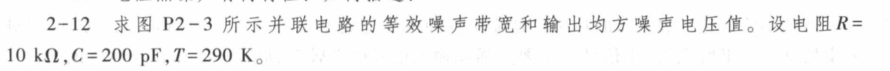
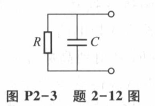

# 2.3 电子噪声及其特性｜学习日志

> 依据：《高频电子线路（第 4 版）》印刷页 46～52（PDF 第 60～66 页）、《第二章 高频电路基础》PPT 第 59～78 页，以及“记录电子噪声及特性”中的课堂记录与提问。典型题 2-12 见教材印刷页 61（PDF 第 75 页）。
>
> 学习主线：**随机起伏 → 均方值与谱密度 → 电阻噪声等效 → 资用功率 → 多噪声源叠加 → 线性网络选频 → 等效噪声带宽 → 晶体管噪声。**
>
> 前接：[2.2 高频电路中的基本电路](2.2-高频电路中的基本电路-学习日志.md)；后接：[2.4.1 噪声系数](2.4.1-噪声系数-学习日志.md)。本次整理整体截止到“噪声系数的计算”之前。

## 0. 先统一符号和学习方法

- **【必须会背/会用】**：主公式及适用条件。
- **【理解推导即可】**：从电路和统计规律推到公式。
- **【易错点】**：课堂疑问、近似条件和单位混淆。

本文采用**单边谱密度**，频率 $`f\geq0`$，积分变量为 Hz。教材的 $`S_u`$ 与 PPT/课堂中的 $`W_u`$ 表示同一种电压噪声谱密度，本文统一写 $`W_u`$。

| 量 | 含义 | 单位 |
| --- | --- | --- |
| $`u_n(t)`$ | 噪声瞬时电压 | V |
| $`\overline{u_n^2}`$ | 噪声电压均方值，教材也记作 $`U_n^2`$ | V² |
| $`u_{n,\mathrm{rms}}=\sqrt{\overline{u_n^2}}`$ | 噪声有效值 | V |
| $`W_u(f)`$、$`W_i(f)`$ | 电压、电流噪声谱密度 | V²/Hz、A²/Hz |
| $`P_n`$ | 给定负载获得的噪声功率 | W |
| $`B`$、$`B_n`$ | 指定频带宽度、等效噪声带宽 | Hz |
| $`H(j\omega)`$ | 指定输入到指定输出的传递函数 | 由输入输出类型决定 |

## 1. 为什么平均值为零，仍然有噪声？

前一节研究电路怎样传输信号，这一节加入真实器件自身产生的随机起伏。接收机前级信号很弱，即使噪声电压很小，也会影响接收质量。

教材把噪声/干扰作为广义电磁扰动讨论，并按来源、表现形式分类；本节重点是**内部固有的随机噪声**。不能简单断言“干扰一定有规律，噪声一定无规律”。

电阻中的自由电子作无规则热运动，大量微小作用叠加，形成随机电压。稳定工作条件下可按平稳随机过程处理，热噪声电压的幅度近似服从零均值正态分布。

```math
\overline{u_n}=0,\qquad
\overline{u_n^2}=\lim_{\tau\to\infty}\frac{1}{\tau}\int_0^\tau u_n^2(t)\,dt>0
```

正负抵消使平均值为零，平方后再平均才能衡量强弱。这里用 $`\tau`$ 表示观察时间，避免和温度 $`T`$ 混淆；时间平均用于通常的平稳、遍历噪声模型。

**【易错点】** “高斯”描述幅度的概率分布，“白”描述谱密度是否随频率变化，二者不是同一个分类维度。有限均方值对应有限有效带宽，理想白噪声无限带宽积分并不有限。

## 2. 电阻热噪声：总量和每 Hz 的量

### 2.1 奈奎斯特公式

**【必须会背/会用】** 温度为 $`T`$、阻值为 $`R`$ 的电阻，在宽度为 $`B`$ 的理想通带内，其开路噪声为：

```math
\boxed{W_u(f)=4kTR},\qquad
\boxed{\overline{u_n^2}=4kTRB},\qquad
\boxed{u_{n,\mathrm{rms}}=\sqrt{4kTRB}}
```

$`k\approx1.38\times10^{-23}\,\mathrm{J/K}`$，$`T`$ 必须用 K，$`B`$ 用 Hz。教材印刷页 47 将 $`k`$ 写为 $`1.37\times10^{-23}`$；本文数值题统一用 $`1.38\times10^{-23}`$，避免近似常数不一致。

适用于本课程的经典热噪声、工作频带内电阻近似不随频率变化的模型。白噪声近似有频率范围，不能外推到任意高频；经典条件可写为 $`hf\ll kT`$，其中 $`h`$ 为普朗克常数。非理想滤波器后应积分或使用 $`B_n`$。

### 2.2 “单位频带内噪声很小”是什么意思？

谱密度回答“频率附近每 Hz 分到多少均方值”，不是某个单独频率上有一份有限功率。

```math
\Delta\overline{u_n^2}\approx W_u(f)\,\Delta f,\qquad
\boxed{\overline{u_n^2}=\int_0^\infty W_u(f)\,df}
```

小频带内谱密度近似恒定才可用乘法；全频带不恒定时要积分。每 Hz 很少，累计很多 Hz 后总量仍可能不可忽略。带宽加倍，均方值加倍，**有效值只变为原来的根号 2 倍**。

**【课堂疑问：$`\Delta f`$ 是什么？】** 在 $`4kTR\Delta f`$ 中它是频带宽度；后面谐振近似中 $`\Delta f=f-f_0`$ 是可正可负的频偏。必须结合上下文区分。

**【易错点】** $`W_u`$ 虽常称“功率谱密度”，单位仍是 V²/Hz。若 $`u_L`$ 是实际负载两端电压，才有 $`P_L=\overline{u_L^2}/R_L`$；不能把开路噪声均方电压直接当瓦特。PPT 的“1 Ω 上的功率”是归一化解释，并非说接上 1 Ω 后电压仍等于开路电压。

### 2.3 PPT 第 64 页例题

已知 $`T=290\,\mathrm K`$、$`R=1\,\mathrm{k\Omega}`$、理想测量带宽 $`B=100\,\mathrm{kHz}`$：

```math
\overline{u_n^2}=4\times1.38\times10^{-23}\times290\times10^3\times10^5
=1.6008\times10^{-12}\,\mathrm{V^2}
```

```math
\boxed{u_{n,\mathrm{rms}}\approx1.27\,\mathrm{\mu V}}
```

这是电阻自身的开路噪声；若还存在分压或增益，应继续按实际传递函数处理。

## 3. 有噪电阻的两种等效电路



*来源：教材印刷页 47，PDF 第 61 页，图 2-28 局部。图中的电阻/电导为无噪元件。*

| 表示法 | 电路 | 噪声源 |
| --- | --- | --- |
| 戴维南形式 | 噪声电压源串联无噪电阻 $`R`$ | $`W_u=4kTR`$ |
| 诺顿形式 | 噪声电流源并联无噪电导 $`G=1/R`$ | $`W_i=4kTG=4kT/R`$ |

**【课堂疑问：电流谱密度怎样推？】** 两种形式是同一个有噪电阻的端口等效。短路电流为 $`i_n=u_n/R`$，因此：

```math
W_i=\frac{W_u}{R^2}=\frac{4kTR}{R^2}=\frac{4kT}{R},\qquad
\overline{i_n^2}=\frac{4kTB}{R}
```

**【易错点】** 选一种等效形式即可，不能把两种源当作独立源同时加入；等效后的电阻也不能再产生第二份热噪声。串联电路通常选电压源，并联电路通常选电流源。

## 4. 资用噪声功率：最大可提供，不等于实际已送出

将电阻 $`R_s`$ 的噪声等效为电压源与内阻串联，接一个只作为接收端的无噪负载 $`R_L`$。先分压，再除以负载电阻：

```math
P_{n,L}=\frac{4kTR_sB}{R_L}\left(\frac{R_L}{R_s+R_L}\right)^2
=kTB\frac{4R_sR_L}{(R_s+R_L)^2}
```

因为 $`(R_s-R_L)^2\geq0`$，上式的匹配因子不超过 1。于是：

```math
\boxed{P_{n,\mathrm{av}}=P_{n,L,\max}=kTB},\qquad
\boxed{R_L=R_s}
```

**【课堂疑问：既然匹配才最大，为什么又与阻值无关？】** 先固定源电阻，再在所有负载中求最大值。每个源都有自己的匹配负载，但求得的最大值都为 $`kTB`$。这不意味着随便接负载都能收到这个值。

例如 $`R_L=R_s`$ 时得到 $`kTB`$；$`R_L=3R_s`$ 时只有 $`0.75kTB`$；开路或短路时负载获得的功率趋于零。资用功率是源的能力指标，**无需真的已经接好匹配负载，便可定义它**。

**【适用条件】** 上述匹配式针对纯电阻；复阻抗源的最大功率条件为共轭匹配。这里仅计算源传给负载的那份噪声，实际有温度的负载也会产生自身噪声，不能混入这份源噪声后仍叫它 $`kTB`$。

## 5. 多个电阻的热噪声：相加的是均方值

### 5.1 为什么不能把有效值直接相加？

对两个零均值噪声：

```math
\overline{(u_{n1}+u_{n2})^2}
=\overline{u_{n1}^2}+\overline{u_{n2}^2}+2\overline{u_{n1}u_{n2}}
```

彼此不相关时交叉项为零，才有均方值相加。两个同样大小的独立噪声，有效值合成为单个的根号 2 倍，而非 2 倍。**相关噪声必须保留交叉项**。

### 5.2 同温、不同温的串并联



*来源：《第二章 高频电路基础》PPT 第 67 页局部。图中等效温度公式用于串联。*

**【必须会背/会用】** 同温度、独立热噪声的纯电阻网络，先求端口等效电阻，再用 $`4kTR_{\mathrm{eq}}B`$。

不同温度时分别计算。串联电阻的开路噪声为：

```math
\overline{u_n^2}=4kB(T_1R_1+T_2R_2),\qquad
T_{\mathrm{eq,s}}=\frac{T_1R_1+T_2R_2}{R_1+R_2}
```

并联时先相加短路电流均方值，再乘端口电阻的平方：

```math
\overline{i_n^2}=4kB\left(\frac{T_1}{R_1}+\frac{T_2}{R_2}\right),\qquad
R_p=\frac{R_1R_2}{R_1+R_2}
```

```math
\overline{u_n^2}=4kBR_p^2\left(\frac{T_1}{R_1}+\frac{T_2}{R_2}\right),\qquad
T_{\mathrm{eq,p}}=\frac{T_1/R_1+T_2/R_2}{1/R_1+1/R_2}
```

并联式为由诺顿模型得到的补充推导。串联按电阻加权，并联按电导加权，不能互换。例如 $`R_1=1\,\mathrm{k\Omega},T_1=300\,\mathrm K`$，$`R_2=2\,\mathrm{k\Omega},T_2=600\,\mathrm K`$：串联等效温度为 500 K，并联为 400 K，均不是简单平均的 450 K。

对于一般网络，要先把每个噪声源传到**同一输出端**，再相加；不能直接相加处于不同节点的噪声均方值。

## 6. 热噪声通过线性网络：先求传递函数，再乘模平方

### 6.1 $`H`$ 和 $`W`$ 的关系

对线性时不变网络，若输入输出都是电压：

```math
H(j\omega)=\frac{U_o}{U_i},\qquad
\boxed{W_{uo}(f)=|H(j2\pi f)|^2W_{ui}(f)}
```

这是**逐频率的谱密度关系**。复数增益乘其共轭才是非负实数，所以用 $`|H|^2`$，不能写成一般的 $`H^2`$。

```math
\boxed{\overline{u_o^2}=\int_0^\infty |H(j2\pi f)|^2W_{ui}(f)\,df}
```

**【纠正课堂口述】** “输入噪声功率乘 $`H`$ 的平方”应先说成“输入电压噪声**谱密度**乘电压传递函数的**模平方**”。不能把一个随频率变化的增益直接乘总噪声。电压增益平方也不自动等于功率增益，后者还与输入输出阻抗及功率定义有关。

网络本身有噪声时，上式只算输入噪声传来的部分；还要加入内部各源经各自传递函数形成的输出贡献。电流到电压应使用传输阻抗，其模平方乘 A²/Hz 后得到 V²/Hz。

### 6.2 课堂 LC 回路：$`H`$ 到底怎么求？



*来源：教材印刷页 49，PDF 第 63 页，图 2-30；对应 PPT 第 69～70 页。*

原电路是“损耗电阻 $`r`$ 与电感 $`L`$ 串联，再与 $`C`$ 并联”。把 $`r`$ 的噪声移为串联电压源，输出取电容两端。此时对噪声源来说，$`r`$、$`L`$、$`C`$ 构成串联分压路径：

```math
Z_C=\frac{1}{j\omega C},\qquad
H(j\omega)=\frac{Z_C}{r+j\omega L+Z_C}
=\frac{-j/(\omega C)}{r+j\left(\omega L-1/(\omega C)\right)}
```

```math
|H(j\omega)|^2=
\frac{(1/\omega C)^2}{r^2+(\omega L-1/\omega C)^2},\qquad
W_{uo}=4kTr\,|H|^2
```

**【易错点】** $`H`$ 由“哪个源输入、在哪里输出”决定。原图画成并联回路，不妨碍噪声等效图中按串联分压求 $`H`$。

## 7. 广义奈奎斯特定理：从端口看入，取有功部分

### 7.1 等效电阻 $`R_e`$ 不是原来的损耗电阻 $`r`$

上述电路从输出端看入：

```math
Z_e=(r+j\omega L)\parallel\frac{1}{j\omega C}=R_e+jX_e
```

```math
\boxed{R_e=\mathrm{Re}(Z_e)
=\frac{r(1/\omega C)^2}{r^2+(\omega L-1/\omega C)^2}}
```

对照上一节，恰好有 $`R_e=r|H|^2`$，因此 $`W_{uo}=4kTR_e`$。$`r`$ 是实物线圈的损耗电阻；$`R_e(f)`$ 是整个网络从端口看入的阻抗实部，通常随频率变化，已经反映电抗元件的传输作用。

### 7.2 定理及条件

**【必须会背/会用】** 由同一温度 $`T`$ 下的无源电阻与理想电抗元件组成、处于热平衡的线性二端网络（一个端口）：

```math
\boxed{W_{u,\mathrm{oc}}(f)=4kT\,\mathrm{Re}[Z(f)]},\qquad
\boxed{W_{i,\mathrm{sc}}(f)=4kT\,\mathrm{Re}[Y(f)]}
```

电压源与无噪阻抗串联，或电流源与无噪导纳并联。PPT 第 73 页写“二端口”，此处应按教材及端口等效图理解为**二端网络/一端口**，不能把整个有源四端网络直接当成一个热电阻。

- 必须取实部，不是 $`|Z|`$；理想 L、C 不独立产生热噪声，但会改变传输和谱形。
- $`\mathrm{Re}(1/Z)`$ 通常不等于 $`1/\mathrm{Re}(Z)`$，不能把 $`G_e`$ 写成 $`1/R_e`$。
- 不同温度的电阻不能随意套一个共同 $`T`$；一般应逐源传输后相加。
- 这是**开路电压/短路电流谱密度**，接入负载后还要计算加载；有源器件的散粒噪声等不能仅靠阻抗实部求出。

### 7.3 PPT 第 72 页：三个并联支路的 RLC 网络



*来源：PPT 第 72 页电路局部。左支路 2 Ω 与 2 H 串联，中支路 1 F，右支路 1 Ω；假定两电阻同温。*

并联先求导纳，再倒数取阻抗实部（代入图示 SI 数值）：

```math
Y_{ab}=1+j\omega+\frac{1}{2+j2\omega}
=\frac{3-2\omega^2+j4\omega}{2+j2\omega}
```

```math
Z_{ab}=\frac{6+4\omega^2}{9+4\omega^2+4\omega^4}
-j\frac{2\omega+4\omega^3}{9+4\omega^2+4\omega^4}
```

```math
\boxed{W_u(f)=4kT\frac{6+4\omega^2}{9+4\omega^2+4\omega^4}},\qquad\omega=2\pi f
```

检验：直流时电感短路、电容开路，$`R_e=1\parallel2=2/3\,\Omega`$；高频时电容趋近短路，端口电压噪声趋小，与上式一致。

## 8. 等效噪声带宽：用等面积矩形代替曲线

### 8.1 定义及 $`H`$、$`W`$ 两种写法



*来源：教材印刷页 50，PDF 第 64 页，图 2-31；对应 PPT 第 74 页。矩形高度为峰值增益的平方。*

令 $`H_0=\max_{f\geq0}|H(j2\pi f)|`$。实际网络不能一刀切地截断噪声，于是以同样高度的矩形替代曲线，保持积分面积不变：

```math
\boxed{B_n=\frac{\int_0^\infty|H(j2\pi f)|^2\,df}{H_0^2}}
```

输入为白噪声 $`W_{ui}=W_0`$，且此处只统计该输入源的输出贡献时：

```math
W_{uo}(f)=W_0|H|^2,\qquad W_{uo,\max}=W_0H_0^2
```

```math
\boxed{B_n=\frac{\int_0^\infty W_{uo}(f)\,df}{W_{uo,\max}}
=\frac{W_0\int_0^\infty|H|^2\,df}{W_0H_0^2}}
```

**【课堂疑问的答案】** 两种写法把同一个输入白噪声谱密度 $`W_0`$ 约掉，得到同一带宽。这里约掉的是谱密度，不是无限带宽的输入总噪声功率。

```math
\boxed{\overline{u_o^2}=W_0H_0^2B_n=4kTRH_0^2B_n}
```

低通网络的峰值若在零频，分母可写 $`W_{uo}(0)`$；带通网络应取峰值，通常在 $`f_0`$ 附近。输入有色或输出混有其他源时，“总输出谱面积/峰值”一般不能直接解释为此传递函数的 $`B_n`$。

**【易错点】** 横轴用 $`f`$ 就积分 $`df`$。改用 $`\omega`$ 时应代入 $`df=d\omega/(2\pi)`$，否则结果差 $`2\pi`$。

### 8.2 高 Q 单调谐回路：课堂积分逐步解释

高 Q、谐振附近，令 $`\Delta f=f-f_0`$：

```math
\frac{|H|^2}{H_0^2}\approx
\frac{1}{1+(2Q\Delta f/f_0)^2},\qquad
R_e\approx\frac{R_0}{1+(2Q\Delta f/f_0)^2}
```

这一近似来自 $`\omega L-1/(\omega C)\approx2L(\omega-\omega_0)`$，并把变化较慢的分子取为谐振值；$`Q\approx\omega_0L/r`$，$`R_0\approx(\omega_0L)^2/r`$。

**【为什么积分下限从 0 变成负无穷？】** 严格换元只会得到：

```math
f\in[0,\infty)\quad\Longrightarrow\quad\Delta f\in[-f_0,\infty)
```

高 Q 时主面积集中在 $`|\Delta f|\ll f_0`$，才把谐振附近的近似曲线延伸到负无穷，简化积分。这不是单边谱变成双边谱，**不要再额外乘 2 或除 2**。

令 $`x=2Q\Delta f/f_0`$，$`d\Delta f=f_0dx/(2Q)`$：

```math
B_n\approx\frac{f_0}{2Q}\int_{-\infty}^{\infty}\frac{dx}{1+x^2}
=\frac{f_0}{2Q}[\arctan x]_{-\infty}^{\infty}
=\frac{\pi f_0}{2Q}
```

因此：

```math
\boxed{B_n\approx\frac{\pi}{2}B_{0.707}\approx1.57B_{0.707}},\qquad
B_{0.707}\approx\frac{f_0}{Q}
```

```math
\boxed{\overline{u_o^2}\approx4kTR_0\frac{\pi f_0}{2Q}}
```

**推导目的：** 先有输出噪声谱，再对频率积分，求出总均方电压；$`B_n`$ 让以后不必重复做同一个积分。$`R_0`$ 是并联谐振电阻，不能换成串联损耗电阻 $`r`$。

### 8.3 噪声带宽不等于 3 dB 带宽

3 dB 带宽看峰值两侧降到半功率的位置，噪声带宽看整条曲线的面积。裙边仍通过噪声，所以两者一般不同。

| 模型 | 噪声带宽与 3 dB 带宽 |
| --- | --- |
| 理想矩形滤波器 | 两者相等 |
| 一阶 RC 低通 | $`B_n=(\pi/2)f_c`$，低通 3 dB 带宽为 $`f_c`$ |
| 高 Q 单调谐带通 | $`B_n\approx(\pi/2)B_{0.707}`$ |
| 教材的临界耦合双调谐回路 | $`B_n\approx1.11B_{0.707}`$，不是任意双调谐回路的通式 |

**【课堂记录校准】** 教材/PPT 说“多级单调谐回路级数越多，$`B_n`$ 越接近 $`B_{0.707}`$”，可作为本节的定性比较，但不要写成对任意级联都严格有比值趋于 1。对于同频、同参数、无相互加载的洛伦兹型级联，归一化功率响应为 $`(1+x^2)^{-m}`$，补充推导得到：

```math
\frac{B_n}{B_{0.707}}
=\frac{\sqrt{\pi}\,\Gamma(m-1/2)}{2\Gamma(m)\sqrt{2^{1/m}-1}}
\longrightarrow\frac{\sqrt{\pi}}{2\sqrt{\ln2}}\approx1.064
```

$`\Gamma`$ 为伽马函数，此式只用于说明适用边界，不要求背诵。$`m=1,2,3`$ 时比值约为 1.571、1.220、1.155；响应比单级更接近等面积矩形，但并非严格变成矩形。

## 9. 教材印刷页 61，题 2-12：并联 RC 热噪声





*来源：教材印刷页 61，PDF 第 75 页，题 2-12 与图 P2-3 分别裁取。*

已知 $`R=10\,\mathrm{k\Omega}`$，$`C=200\,\mathrm{pF}`$，$`T=290\,\mathrm K`$。求等效噪声带宽及输出均方噪声电压。输出端不另接负载，C 为理想无损元件。

### 第一步：从端口看入，取实部

```math
Z=\frac{R}{1+j\omega RC}
=\frac{R}{1+(\omega RC)^2}-j\frac{\omega R^2C}{1+(\omega RC)^2}
```

```math
\boxed{W_u(f)=4kT\mathrm{Re}(Z)
=\frac{4kTR}{1+(2\pi fRC)^2}}
```

另一条等价路径：用电阻串联噪声电压源等效，得到 $`H=1/(1+j\omega RC)`$，再用 $`4kTR|H|^2`$。两种方法给出相同谱密度。

### 第二步：积分求噪声带宽

本题峰值在 $`f=0`$，$`W_u(0)=4kTR`$：

```math
B_n=\frac{\int_0^\infty W_u(f)\,df}{W_u(0)}
=\int_0^\infty\frac{df}{1+(2\pi fRC)^2}
```

令 $`x=2\pi fRC`$：

```math
B_n=\frac{1}{2\pi RC}\int_0^\infty\frac{dx}{1+x^2}
=\frac{1}{2\pi RC}\frac{\pi}{2}
=\boxed{\frac{1}{4RC}}
```

```math
RC=10^4\times200\times10^{-12}=2.0\times10^{-6}\,\mathrm s,\qquad
\boxed{B_n=1.25\times10^5\,\mathrm{Hz}=125\,\mathrm{kHz}}
```

### 第三步：求均方值，最后才开方

```math
\overline{u_n^2}=W_u(0)B_n=4kTR\frac{1}{4RC}
=\boxed{\frac{kT}{C}}
```

```math
\boxed{\overline{u_n^2}=\frac{1.38\times10^{-23}\times290}{200\times10^{-12}}
\approx2.00\times10^{-11}\,\mathrm{V^2}}
```

若补求有效值：$`u_{n,\mathrm{rms}}\approx4.47\,\mathrm{\mu V}`$。题目要求的“均方值”应答 V²，不能只交有效值。

### 结果为什么与 R 无关？

R 增大使低频谱密度 $`4kTR`$ 增大，同时使带宽 $`1/(4RC)`$ 缩小，两个因素正好抵消。这个结论属于**理想 RC 网络、热平衡、全频带积分**；若指定有限测量频带，不能直接套 $`kT/C`$。

核对 3 dB 带宽：$`f_c=1/(2\pi RC)\approx79.6\,\mathrm{kHz}`$，确有 $`B_n=(\pi/2)f_c=125\,\mathrm{kHz}`$。此处积分从 0 到正无穷，$`\arctan`$ 差为 $`\pi/2`$；上一节带通频偏近似积分从负无穷到正无穷，差为 $`\pi`$，不要混用。

## 10. 晶体管噪声：器件不只有热噪声

### 10.1 双极型晶体管 BJT

| 噪声 | 物理来源 | 本节要掌握的特性 |
| --- | --- | --- |
| 电阻热噪声 | 基区体电阻等分布电阻 | 本课程频带内近似白噪声；可用热噪声模型 |
| 散粒噪声 | 离散载流子随机通过 PN 结，电流围绕平均值起伏 | 简化模型下 $`W_i(f)=2qI_0`$，近似白噪声 |
| 分配噪声 | 发射极载流子在集电极与基极之间的分配比例随机变化 | $`I_E=I_C+I_B`$ 是守恒关系；分配比例的起伏才是噪声原因，高频渡越效应使其增强 |
| 闪烁噪声 | 材料、表面及复合等随机过程 | 近似 $`1/f`$ 谱，低频更突出 |

**【必须会背/会用】** 肖特基散粒噪声公式（单边谱、独立载流子到达的简化模型）：

```math
\boxed{W_i(f)=2qI_0},\qquad
\boxed{\overline{i_n^2}=2qI_0B},\qquad q\approx1.60\times10^{-19}\,\mathrm C
```

$`I_0`$ 是相应 PN 结的平均直流电流，不是噪声有效值。散粒噪声不应套 $`4kTR`$；它与热噪声在产生机理上不同，但在线性网络中的谱传输方法相同。

PPT 第 77 页另列分配噪声模型：

```math
W_{i_c,\mathrm{part}}(f)=2qI_C\left(1-\frac{|\alpha(f)|^2}{\alpha_0}\right)
```

$`\alpha(f)`$ 为共基极电流传输系数，$`\alpha_0`$ 为其低频值。只需理解分配及频率效应，不把这一项与另一套已经包含同样效应的晶体管等效源重复相加。

**【资料校准】** PPT 用“1 kHz”概括闪烁噪声影响范围，教材写“几千赫兹以下”；这是课程中的典型量级，真实转折频率取决于器件与偏置。PPT 第 77 页图中标成“3 dB/十倍频”和“6 dB/十倍频”的斜率不宜照抄：若按功率谱 $`1/f`$、$`f^2`$ 理解，分别对应 −10、+20 dB/十倍频（约 −3、+6 dB/倍频）。本节只取“低频闪烁—中频近似白—高频上升”的趋势。

### 10.2 场效应管 FET

依据教材印刷页 52、PPT 第 78 页：

- **沟道热噪声**：导电沟道的热起伏，是主要来源之一。
- **栅极散粒噪声**：与栅极漏电等有关，课程模型中通常很小。
- **栅极感应噪声**：沟道噪声经沟道—栅极电容耦合到栅极，高频分析需要关注；与沟道噪声可能相关。
- **闪烁噪声**：低频突出，不能仅凭 FET 名称就断定低频噪声一定更小。

FET 没有 BJT 中的这种少数载流子分配噪声，散粒噪声一般较小；PPT 因而给出“通常噪声小于 BJT”的概括。实际优劣仍取决于频率、源阻抗、器件和偏置，不能把它当作所有放大器的选型结论。

## 11. 复习时先回答这些问题

| 问题 | 应抓住的答案 |
| --- | --- |
| 教材 2-11：热噪声有何特性、如何描述？ | 随机、近似零均值高斯；本课程频带内近似白噪声；用均方值、有效值及谱密度描述 |
| 教材 2-13：白噪声经过线性网络还是白噪声吗？ | 不一定；看 $`|H|^2W_{ui}`$ 是否仍为常数，选频网络后一般有色 |
| 多个电阻能否先等效？ | 同温无源热平衡网络可用端口等效；不同温度一般逐源处理 |
| $`4kTR`$ 与 $`kT`$ 差在哪里？ | 前者为开路电压谱密度 V²/Hz；后者为匹配资用功率谱密度 W/Hz |
| $`W`$ 怎么换成 PPT 的 $`H`$？ | 输入白噪声时 $`W_{uo}=W_0|H|^2`$，等效带宽分子分母约去 $`W_0`$ |
| 题 2-12 最容易错哪里？ | pF 换算、$`df`$ 的 $`2\pi`$、低通半轴积分、把均方值写成有效值 |

## 12. 来源与范围记录

| 内容 | 教材印刷页（PDF 页序） | PPT 页码 |
| --- | --- | --- |
| 概述、热噪声、等效源与谱密度 | 46～48（60～62） | 59～66 |
| 多电阻、线性网络、端口等效 | 48～50（62～64） | 67～73 |
| 噪声带宽 | 50～51（64～65） | 74～76 |
| BJT、FET 噪声 | 51～52（65～66） | 77～78 |
| 题 2-11、2-12、2-13 | 61（75） | 2-12 另与课堂解答核对 |

来源图片均为本项目教材/PPT 的局部裁图。不同温度并联公式、级联带宽边界说明和量纲/极限检查为笔记中的补充推导；课堂口述与材料中的简化表述已在相应位置注明条件。
