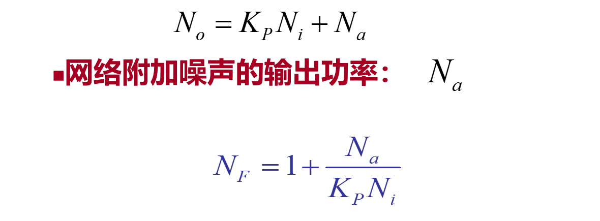
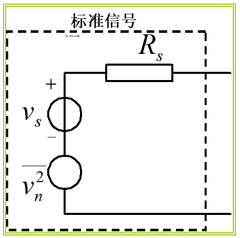

# 2.4.1 噪声系数｜学习日志

> 依据：《高频电子线路（第 4 版）》印刷页 52～54（PDF 第 66～68 页）、《第二章 高频电路基础》PPT 第 79～87 页，以及课堂关于标准信号源、资用功率、附加噪声、匹配和准线性的提问。
>
> 学习主线：**输出信噪比 → 网络使信噪比恶化多少 → 三种等价表述 → 统一输入噪声基准 → 点频、匹配与适用范围。**
>
> 前接：[2.3 电子噪声及其特性](2.3-电子噪声及其特性-学习日志.md)。本文截止于教材“二、噪声系数的计算”和 PPT 第 88 页“2.4.2 噪声系数的计算”之前；保留定义讨论中出现的开路/短路等价表达，不展开额定功率法、具体网络计算及噪声温度。

## 1. 为什么知道输出噪声，还要引入噪声系数？

仅说“输出噪声很大”无法判断信号质量，因为信号可能也很大。先引入信噪比，用同一端口、规定频带内的信号功率与噪声功率作比：

```math
\boxed{\frac{S}{N}=\frac{\text{信号功率}}{\text{噪声功率}}}
```

信噪比越大，信号相对噪声越突出。但输出信噪比既受网络影响，又受输入信号质量影响，不能只用输出信噪比评价网络本身。

例如，输入信噪比 100 的网络输出 50，输入信噪比 20 的另一个网络输出 10，两者都让信噪比降低为原来的一半。于是比较**输入与输出信噪比之比**。

## 2. 定义：理想网络是比较基准

**【必须会背/会用】** 在标准信号源激励下：

```math
\boxed{F=N_F=\frac{(S/N)_i}{(S/N)_o}
=\frac{S_i/N_i}{S_o/N_o}}
```

本文用 $`F`$ 表示线性比值，对应教材/PPT 的 $`N_F`$。理想无噪网络具有与实际网络相同的信号传输特性和端口条件，只是不增加自身噪声：信号与输入噪声按同样的线性规律传输，信噪比保持不变，$`F=1`$。

对本课程的普通线性加性噪声模型，内部附加噪声使 $`F\geq1`$；有非零附加噪声时 $`F>1`$。因此“输入信噪比大于输出”在理想极限应允许等号。

分贝形式（噪声指数）为：

```math
\boxed{NF_{\mathrm{dB}}=10\log_{10}F}
```

例如 $`F=2`$ 对应约 3.01 dB，理想网络 $`F=1`$ 对应 0 dB。**这是功率比，用 10 log，不是 20 log。** PPT 有时混用“系数/指数”的名称，答题时要明确线性数值还是 dB。

## 3. 三种表述为什么是同一个定义？

### 3.1 信噪比恶化程度

这就是定义：$`F=(S_i/N_i)/(S_o/N_o)`$。例如输入信噪比 100，输出为 50，则 $`F=2`$。

### 3.2 实际输出噪声 ÷ 仅由输入噪声造成的输出噪声

沿用教材 $`K_P=S_o/S_i`$，代入得：

```math
F=\frac{S_iN_o}{N_iS_o}
=\boxed{\frac{N_o}{K_PN_i}}
```

分子 $`N_o`$ 是实际网络总输出噪声，分母 $`K_PN_i`$ 是理想网络的输出噪声：输入源噪声传过来有多少，就作为基准。

**【易错点】** 第二种表述不是 $`N_o/N_i`$，因为输入输出不在同一位置，必须把输入噪声传到输出端再比较。

### 3.3 理想值 1，加上附加噪声造成的增量



*来源：《第二章 高频电路基础》PPT 第 82 页局部；此处 $`N_F`$ 即本文 $`F`$。*

```math
\boxed{N_o=K_PN_i+N_a}
```

```math
\boxed{F=1+\frac{N_a}{K_PN_i}}
```

$`N_a`$ 是网络内部各噪声源最终在输出端形成的附加噪声功率。“1”来自输入源原有噪声的传输，增量来自网络自身。

三种表述应连着记：

```math
\boxed{F=\frac{(S/N)_i}{(S/N)_o}
=\frac{N_o}{K_PN_i}
=1+\frac{N_a}{K_PN_i}}
```

**【统一口径】** 这些式子通常在指定点频的窄频带内使用，信号和输入噪声经历同一传输系数。$`S_i,N_i`$、$`S_o,N_o,N_a`$ 必须分别保持一致的功率定义；跨宽频带且增益变化时，先按谱积分，不能直接用一个任意中心频率增益乘总输入噪声。

## 4. 标准信号源：为什么一定要规定 290 K？



*来源：PPT 第 80 页局部。信号源内阻为 $`R_s`$，噪声只取该电阻的热噪声；温度约定见第 84 页。*

同一个网络，如果故意提高输入源噪声，网络额外增加的噪声就显得不明显，算出的“恶化程度”可能变小。为了可以比较，必须统一输入噪声基准。

标准信号源包含信号电压源、内阻 $`R_s`$，并只含该内阻在标准温度下产生的白噪声：

```math
\boxed{T_0=290\,\mathrm K},\qquad
\overline{u_{ns}^2}=4kT_0R_sB,\qquad
\boxed{N_i=kT_0B}
```

这里 $`N_i`$ 按信号源的**资用噪声功率**规定；不一定等于网络输入端实际收到的噪声。它是“假设最佳匹配，源最多能提供多少”，不是“现在已收到多少”。

### 4.1 课堂疑问：负载没确定，怎么能写 $`kT_0B`$？

因为资用功率可以先于实际负载定义。对纯电阻输入 $`R_{\mathrm{in}}`$，实际接收的那份源噪声为：

```math
N_{i,\mathrm{del}}=M_iN_i,\qquad
M_i=\frac{4R_sR_{\mathrm{in}}}{(R_s+R_{\mathrm{in}})^2}\leq1
```

只有输入匹配时，$`M_i=1`$，资用值才等于实际输入值。固定源电压下，信号的资用功率和实际交付功率也受到同样的匹配因子影响，源信噪比中的这个因子会约去。

**【易错点：$`K_P`$ 不能混用】** 若 $`S_i,N_i`$ 采用源资用功率，则 $`K_P=S_o/S_i`$ 必须把输入失配造成的传输影响包含进去；不能把“从实际输入端已接收功率算起的增益”直接乘资用 $`kT_0B`$。采用上述后一种增益时，应先乘 $`M_i`$。这只是定义口径的澄清，具体额定功率计算留到下一节。

### 4.2 $`T_0`$ 规定的是谁的温度？

规定的是**比较基准中信号源内阻的温度**，不要求整个放大器和负载全部处于 290 K。网络内部温度变化会影响 $`N_a`$，进而改变其噪声性能。

## 5. 课堂疑问：网络“自己增加的输出噪声”从哪里来？

$`N_a`$ 不是输出口凭空放置的一个新噪声源，它是电阻热噪声、晶体管噪声等经过各自传输路径后的输出贡献总和。

```text
源电阻的噪声 → 通过网络 → 输入源造成的输出噪声
内部电阻噪声 → 各自路径 → 附加输出噪声的一部分
晶体管噪声   → 各自路径 → 附加输出噪声的另一部分
```

若内部各源不相关，用适当传递函数把它们统一成输出电压谱密度后，可写成概念式：

```math
W_{u,a}(f)=\sum_m|H_m(j2\pi f)|^2W_m(f),\qquad
\overline{u_a^2}=\int W_{u,a}(f)\,df
```

输入源为电流时，$`H_m`$ 要用传输阻抗；有相关源时还要保留交叉谱项。电压与电流谱密度不能直接混加。

若这已是接入纯电阻负载后、负载两端的附加噪声电压，才有：

```math
N_a=\frac{\overline{u_{a,L}^2}}{R_L}
```

若算的是输出开路电压，则先考虑分压；若采用资用功率口径，则按相应匹配能力定义。**不知道具体电路时，不能仅凭 $`N_a`$ 这个名字求出数值。**

**【小例子：只帮助理解定义】** 假设在同一输出端、同一带宽和功率口径下，输入源传来的噪声为 10 nW，网络内部贡献为 5 nW，则总输出为 15 nW，$`F=15/10=1.5`$。这时 5 nW 才是 $`N_a`$，不是总输出 15 nW。

## 6. 点频与带内平均：F 可以随频率变化

教材/PPT 强调优先在规定频率处，用窄频带的噪声功率或谱密度定义：

```math
F(f)=\frac{W_{N,o}(f)}{K_P(f)kT_0}
```

此处 $`W_{N,o}`$ 是与所用功率口径一致的**输出噪声功率谱密度（W/Hz）**，不是上一节的电压谱密度 $`W_u`$。内部噪声谱和增益都可能随频率变化，因此 $`F`$ 也随频率变化。

宽带时，实际输出噪声与理想输出噪声分别积分再相除。对同一观察频带 $`\mathcal B`$，可得到按增益加权的噪声比：

```math
F_{\mathcal B}
=\frac{\int_{\mathcal B}F(f)K_P(f)kT_0\,df}
{\int_{\mathcal B}K_P(f)kT_0\,df}
```

它不是 $`F(f)`$ 的随意算术平均，也不能直接平均各频率的 dB 值。若用输入输出信噪比定义带内指标，还需使信号、噪声的带宽与传输约定一致。

## 7. 匹配：输出负载影响功率，为什么不影响这个比值？

### 7.1 输出端：比较双方受相同加载

在教材采用的线性端口模型中，实际网络与对应理想无噪网络具有相同输出阻抗。接负载后，两者的输出开路噪声电压都乘相同的分压系数，因此在均方值的比中约去。

```math
\boxed{F=\frac{\overline{u_{no}^2}}{\overline{u_{nio}^2}}
=\frac{\overline{i_{no}^2}}{\overline{i_{nio}^2}}}
```

这里前一个比是输出**开路**均方电压比，后一个比是输出**短路**均方电流比；分子为实际总噪声，分母为仅输入源引起的理想输出噪声。它们分别对应课上提到的开路电压法、短路电流法的依据，具体电路算法本次不展开。

**【易错点】** 开路/短路时不能直接做两个零负载功率的比；应使用上述电压/电流形式或极限意义。输出负载自身的热噪声也不计入被测网络的附加噪声。这里“输出匹配不影响 F”不等于“实际输出噪声功率不受负载影响”。

此结论是在教材的固定工作状态、同一端口模型和一致输出口径下讨论；若改变负载使有源器件工作状态或模型发生变化，应重新分析，不能机械沿用约分结论。

### 7.2 输入端：源阻抗仍然影响噪声性能

虽然标准源资用噪声 $`kT_0B`$ 不显含 $`R_s`$，实际输入传输、源噪声的电压/电流表示以及内部噪声到输出的贡献仍与源阻抗有关。因此，噪声系数要在规定的源阻抗、频率和偏置条件下讨论。

**【必须理解】** 使噪声系数最小的“噪声匹配”不一定就是使信号功率传输最大的“功率匹配”。不能从 $`kT_0B`$ 不含阻值，推导出 F 与源阻抗无关。

## 8. 线性与准线性：怎样理解“只产生频率搬移”？

本课程的噪声系数讨论采用线性或准线性的小信号模型。若电路明显限幅、压缩，或存在显著的信号—噪声相互作用，就不能直接用前面的同一增益传输和简单加性分解。

混频器本身含非线性器件，但在给定强本振、小输入信号条件下，选定输出频带的信号可以近似看成对输入的线性频率变换。以乘法模型说明：

```math
x(t)=A\cos\omega_st,\qquad
y(t)=Kx(t)\cos\omega_{\mathrm{LO}}t
```

```math
y(t)=\frac{KA}{2}\left[\cos(\omega_s-\omega_{\mathrm{LO}})t
+\cos(\omega_s+\omega_{\mathrm{LO}})t\right]
```

滤出目标频带后，频率改变，但目标分量幅度仍与小信号输入幅度成比例，这就是课堂“准线性”的直观含义。

**【课堂记录校准】** “只产生频率搬移”不表示幅度不变，也不保证实际混频器没有其他分量、失真或附加噪声。这里是选定本振、频带与小信号范围后的近似；分析噪声时还需明确哪些输入频带被搬到输出。教材此处用于说明接收机高放、变频、中放可以纳入讨论，不把检波后的强非线性行为直接套入同一公式。

## 9. 到计算章节之前，应能说清楚什么？

| 课堂问题 | 准确回答 |
| --- | --- |
| 理想网络是什么？ | 保留相同传输与端口条件，去掉自身附加噪声的比较模型；$`F=1`$ |
| 为什么规定标准信号源？ | 输入噪声会影响恶化比例，须统一到 $`T_0=290\,\mathrm K`$ 的源内阻热噪声 |
| 未匹配为什么仍可写 $`N_i=kT_0B`$？ | $`N_i`$ 为资用值；实际交付值还乘匹配因子 |
| $`N_a`$ 到底是什么？ | 内部噪声源经各自路径传到输出端的贡献，不是总输出，也不是固定常数 |
| 输出负载变了，噪声功率会变吗？ | 会；但在教材固定模型下，实际/理想两份噪声受相同加载，比值不变 |
| F 与输入匹配有关吗？ | 有关；规定源资用噪声不等于消除了源阻抗的影响 |
| 准线性等于完全线性吗？ | 不等于；给定强本振时，对小信号可近似线性搬移频谱 |

**【必须会背/会用】**

```math
F=\frac{(S/N)_i}{(S/N)_o}
=\frac{N_o}{K_PN_i}
=1+\frac{N_a}{K_PN_i},\qquad
N_i=kT_0B,\quad T_0=290\,\mathrm K
```

下一步才进入教材印刷页 54“二、噪声系数的计算”及 PPT 第 88 页的额定功率法。本篇未整理该部分及其后内容。
